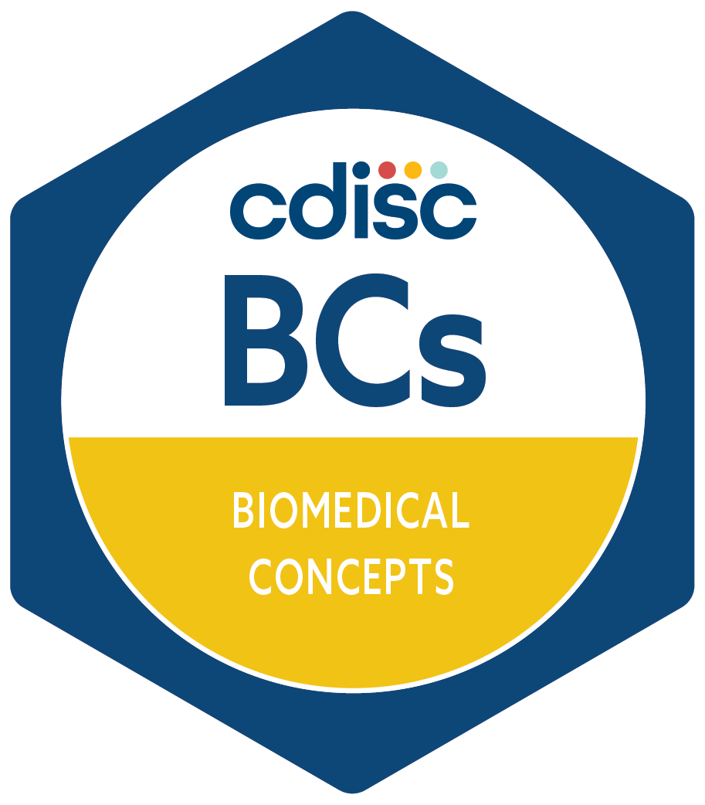

# CDISC Conceptual and Operational Standards Metadata Services (COSMoS)

The [COSMoS GitHub repository](https://github.com/cdisc-org/COSMoS) contains working files and other artefacts to support the implementation of Biomedical Concepts (BCs) and Dataset Specializations in the CDISC Library.
Below is an overview of the contents of this repository.

- **bc_starter_package**

  This folder contains a [CDISC Biomedical Concepts Starter Package](bc_starter_package/README.md) for:
  - users who want to create CDISC BCs and Dataset Specializations
  - Users who want to retrieve and use BCs and Dataset Specializations from the CDISC Library
  - Users who want to provide feedback on BCs and Dataset Specializations

- **curation**

  The [curation](curation) folder contains spreadsheets that were used for loading of BCs and SDTM Specializations.

- **curation/draft**

  The [curation/draft](curation/draft) folder contains draft curation spreadsheets that are still work in progress.
  The content in these draft spreadsheets is neither validated nor loaded in the CDISC Library.

- **export**

  The [export](export) folder contains spreadsheets with the latest versions of all BCs and SDTM Dataset Specializations in the CDISC Library:
  - [Latest CDISC Biomedical Concepts](export/cdisc_biomedical_concepts_latest.xlsx) (Excel spreadsheet)
  - [Latest SDTM Dataset Specializations](export/cdisc_sdtm_dataset_specializations_latest.xlsx) (Excel spreadsheet)

- **model**

  The [model](model) folder contains files (cosmos_bc_model.yaml and cosmos_sdtm_bc_model.yaml) according to the [LinkML](https://linkml.io/linkml/) specification.
   It also contains several other files auto generated from the model:
  - cosmos_bc_model.json amd cosmos_sdtm_bc_model.json:
    JSON schema files describing the machine-readable YAML files
  - cosmos_bc_model.svg, cosmos_bc_model.yuml, cosmos_sdtm_bc_model.svg, cosmos_sdtm_bc_model.yuml:
    Entity diagrams
  - cosmos_bc_model.py, cosmos_sdtm_bc_model.py:
    Python models

- **openapi**

  The [openapi](openapi) folder contains the OpenAPI definition of the COSMoS API (cosmos.yaml)

  More information about using the CDISC Library API can be found on the [CDISC Library API Portal](https://api.developer.library.cdisc.org/) and the [Biomedical Concepts and Dataset Specializations Release Notes](https://wiki.cdisc.org/pages/viewpage.action?pageId=169412277) on the CDISC Wiki.
  Use your cdiscID credentials to login to the [CDISC Library API Portal](https://api.developer.library.cdisc.org/).

- **projects**

  The [projects](projects) folder contains various artefacts generated from the [LinkML](https://linkml.io/linkml/) schema, such as JSON-Schema, or the Python object model.

- **utilities**

  The [utilities](utilities) folder contains utilities to:
  - Validate the curation spreadsheets
  - Generate YAML files from the curation spreadsheets
  - Create Excel spreadsheets from JSON files requested through the API

- **yaml**

  The [yaml](yaml) folder contains:
  - YAML files generated from the curation spreadsheets
  - Scripts to validate the YAML files

## License

 

### Code & Scripts

This project is using the [MIT](http://www.opensource.org/licenses/MIT "The MIT License | Open Source Initiative") license (see [`LICENSE`](LICENSE)) for code and scripts.

### Content

The content files like documentation and minutes are released under [CC-BY-4.0](https://creativecommons.org/licenses/by/4.0/). This does not include trademark permissions.

## Re-use

When you re-use the source, keep or copy the license information also in the source code files. When you re-use the source in proprietary software or distribute binaries (derived or underived), copy additionally the license text to a third-party-licenses file or similar.

When you want to re-use and refer to the content, please do so like the following:

> Content based on [COSMoS (GitHub)](https://github.com/cdisc-org/COSMoS) used under the [CC-BY-4.0](https://creativecommons.org/licenses/by/4.0/) license.
