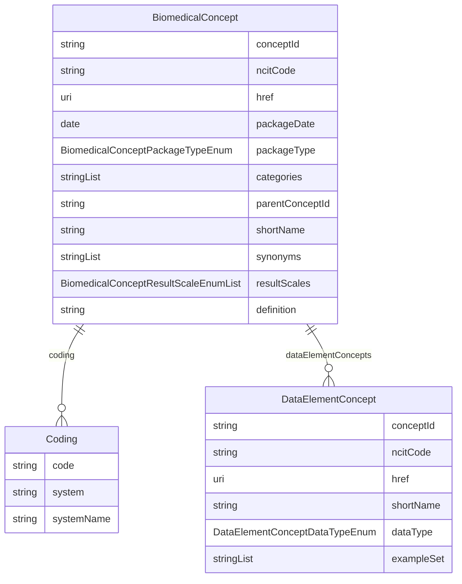

```mermaid
erDiagram
BiomedicalConcept {
    string conceptId  
    string ncitCode  
    uri href  
    date packageDate  
    BiomedicalConceptPackageTypeEnum packageType  
    stringList categories  
    string parentConceptId  
    string shortName  
    stringList synonyms  
    BiomedicalConceptResultScaleEnumList resultScales  
    string definition  
}
Coding {
    string code  
    string system  
    string systemName  
}
DataElementConcept {
    string conceptId  
    string ncitCode  
    uri href  
    string shortName  
    DataElementConceptDataTypeEnum dataType  
    stringList exampleSet  
}

BiomedicalConcept ||--}o Coding : "coding"
BiomedicalConcept ||--}o DataElementConcept : "dataElementConcepts"

```

