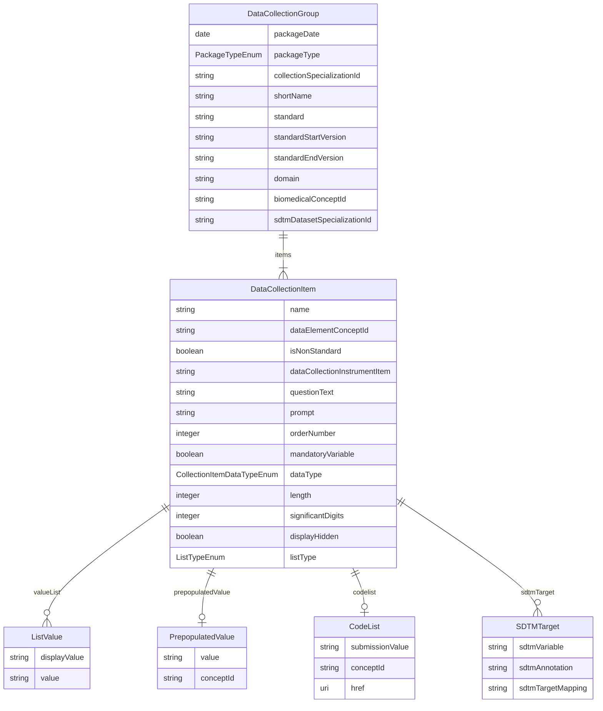

```mermaid
erDiagram
DataCollectionGroup {
    date packageDate  
    PackageTypeEnum packageType  
    string collectionSpecializationId  
    string shortName  
    string standard  
    string standardStartVersion  
    string standardEndVersion  
    string domain  
    string biomedicalConceptId  
    string sdtmDatasetSpecializationId  
}
DataCollectionItem {
    string name  
    string dataElementConceptId  
    boolean isNonStandard  
    string dataCollectionInstrumentItem  
    string questionText  
    string prompt  
    integer orderNumber  
    boolean mandatoryVariable  
    CollectionItemDataTypeEnum dataType  
    integer length  
    integer significantDigits  
    boolean displayHidden  
    ListTypeEnum listType  
}
ListValue {
    string displayValue  
    string value  
}
PrepopulatedValue {
    string value  
    string conceptId  
}
CodeList {
    string submissionValue  
    string conceptId  
    uri href  
}
SDTMTarget {
    string sdtmVariable  
    string sdtmAnnotation  
    string sdtmTargetMapping  
}

DataCollectionGroup ||--}| DataCollectionItem : "items"
DataCollectionItem ||--}o ListValue : "valueList"
DataCollectionItem ||--|o PrepopulatedValue : "prepopulatedValue"
DataCollectionItem ||--|o CodeList : "codelist"
DataCollectionItem ||--}o SDTMTarget : "sdtmTarget"

```

