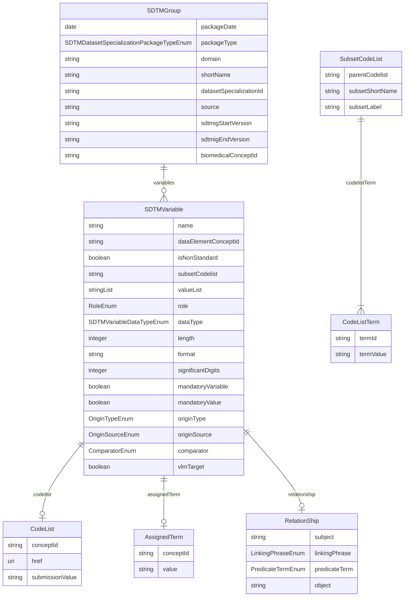

```mermaid
erDiagram
SDTMGroup {
    date packageDate  
    SDTMDatasetSpecializationPackageTypeEnum packageType  
    string domain  
    string shortName  
    string datasetSpecializationId  
    string source  
    string sdtmigStartVersion  
    string sdtmigEndVersion  
    string biomedicalConceptId  
}
SDTMVariable {
    string name  
    string dataElementConceptId  
    boolean isNonStandard  
    string subsetCodelist  
    stringList valueList  
    RoleEnum role  
    SDTMVariableDataTypeEnum dataType  
    integer length  
    string format  
    integer significantDigits  
    boolean mandatoryVariable  
    boolean mandatoryValue  
    OriginTypeEnum originType  
    OriginSourceEnum originSource  
    ComparatorEnum comparator  
    boolean vlmTarget  
}
RelationShip {
    string subject  
    LinkingPhraseEnum linkingPhrase  
    PredicateTermEnum predicateTerm  
    string object  
}
CodeList {
    string conceptId  
    uri href  
    string submissionValue  
}
CodeListTerm {
    string termId  
    string termValue  
}
SubsetCodeList {
    string parentCodelist  
    string subsetShortName  
    string subsetLabel  
}
AssignedTerm {
    string conceptId  
    string value  
}

SDTMGroup ||--}o SDTMVariable : "variables"
SDTMVariable ||--|o CodeList : "codelist"
SDTMVariable ||--|o AssignedTerm : "assignedTerm"
SDTMVariable ||--|o RelationShip : "relationship"
SubsetCodeList ||--}| CodeListTerm : "codelistTerm"

```

