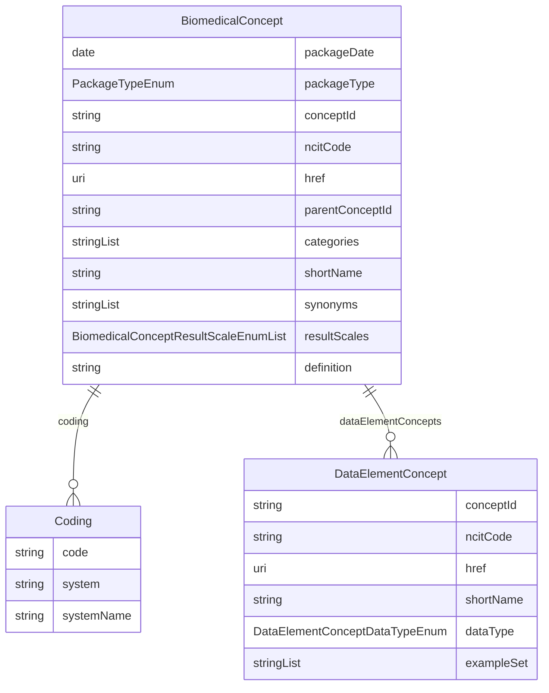

# Class: BiomedicalConcept 


URI: [cosmos_bc:class/BiomedicalConcept](https://www.cdisc.org/cosmos/biomedical_concept_v1.0class/BiomedicalConcept)





<!-- no inheritance hierarchy -->


## Slots

| Name | Cardinality and Range | Description | Inheritance |
| ---  | --- | --- | --- |
| [packageDate](../slots/packageDate.md) | 1 <br/> [Date](../types/Date.md) | Biomedical Concept package release date indicating when the BC package was published to production | direct |
| [packageType](../slots/packageType.md) | 1 <br/> [PackageTypeEnum](../enums/PackageTypeEnum.md) | Package type (bc for Biomedical Concepts) | direct |
| [conceptId](../slots/conceptId.md) | 1 <br/> [String](../types/String.md) | A unique identifier for a Biomedical Concept which will be assigned as the NCIt code if it exists or a placeholder identifier if the concept is not yet available in NCIt | direct |
| [ncitCode](../slots/ncitCode.md) | 0..1 <br/> [String](../types/String.md) | NCIt C-code for the Biomedical Concept | direct |
| [href](../slots/href.md) | 0..1 <br/> [Uri](../types/Uri.md) | URI link to NCIt for the Biomedical Concept; blank if  concept is not available in NCIt | direct |
| [parentConceptId](../slots/parentConceptId.md) | 0..1 <br/> [String](../types/String.md) | C-code for the parent concept in the NCIt hiearchy; blank if concept is not available in NCIt | direct |
| [categories](../slots/categories.md) | 1..* <br/> [String](../types/String.md) | Biomedical Concept category for the faciliation of API search and extract | direct |
| [shortName](../slots/shortName.md) | 1 <br/> [String](../types/String.md) | NCI Preferred Name for the concept; provisional name will be used if concept is not available in NCIt | direct |
| [synonyms](../slots/synonyms.md) | * <br/> [String](../types/String.md) | Biomedical Concept synonym equivalent to BC short name for the facilitation of API search and extraction | direct |
| [resultScales](../slots/resultScales.md) | * <br/> [BiomedicalConceptResultScaleEnum](../enums/BiomedicalConceptResultScaleEnum.md) | Scale of measurement for the Biomedical Concept result | direct |
| [definition](../slots/definition.md) | 1 <br/> [String](../types/String.md) | NCIt definition for the Biomedical Concept; provisional defintion if concept is not available in NCIt | direct |
| [coding](../slots/coding.md) | * <br/> [Coding](../classes/Coding.md) | Coding for the Biomedical Concept | direct |
| [dataElementConcepts](../slots/dataElementConcepts.md) | * <br/> [DataElementConcept](../classes/DataElementConcept.md) | Data Element Concept | direct |


## Identifier and Mapping Information


### Schema Source


* from schema: https://www.cdisc.org/cosmos/biomedical_concept_v1.0


## Mappings

| Mapping Type | Mapped Value |
| ---  | ---  |
| self | cosmos_bc:BiomedicalConcept |
| native | cosmos_bc:BiomedicalConcept |


## LinkML Source

<!-- TODO: investigate https://stackoverflow.com/questions/37606292/how-to-create-tabbed-code-blocks-in-mkdocs-or-sphinx -->

### Direct

<details>
```yaml
name: BiomedicalConcept
from_schema: https://www.cdisc.org/cosmos/biomedical_concept_v1.0
slots:
- packageDate
- packageType
- conceptId
- ncitCode
- href
- parentConceptId
- categories
- shortName
- synonyms
- resultScales
- definition
- coding
- dataElementConcepts
slot_usage:
  conceptId:
    name: conceptId
    description: A unique identifier for a Biomedical Concept which will be assigned
      as the NCIt code if it exists or a placeholder identifier if the concept is
      not yet available in NCIt
  ncitCode:
    name: ncitCode
    description: NCIt C-code for the Biomedical Concept
  href:
    name: href
    description: URI link to NCIt for the Biomedical Concept; blank if  concept is
      not available in NCIt
tree_root: true

```
</details>

### Induced

<details>
```yaml
name: BiomedicalConcept
from_schema: https://www.cdisc.org/cosmos/biomedical_concept_v1.0
slot_usage:
  conceptId:
    name: conceptId
    description: A unique identifier for a Biomedical Concept which will be assigned
      as the NCIt code if it exists or a placeholder identifier if the concept is
      not yet available in NCIt
  ncitCode:
    name: ncitCode
    description: NCIt C-code for the Biomedical Concept
  href:
    name: href
    description: URI link to NCIt for the Biomedical Concept; blank if  concept is
      not available in NCIt
attributes:
  packageDate:
    name: packageDate
    description: Biomedical Concept package release date indicating when the BC package
      was published to production
    from_schema: https://www.cdisc.org/cosmos/biomedical_concept_v1.0
    rank: 1000
    alias: packageDate
    owner: BiomedicalConcept
    domain_of:
    - BiomedicalConcept
    range: date
    required: true
  packageType:
    name: packageType
    description: Package type (bc for Biomedical Concepts)
    from_schema: https://www.cdisc.org/cosmos/biomedical_concept_v1.0
    rank: 1000
    alias: packageType
    owner: BiomedicalConcept
    domain_of:
    - BiomedicalConcept
    range: PackageTypeEnum
    required: true
  conceptId:
    name: conceptId
    description: A unique identifier for a Biomedical Concept which will be assigned
      as the NCIt code if it exists or a placeholder identifier if the concept is
      not yet available in NCIt
    from_schema: https://www.cdisc.org/cosmos/biomedical_concept_v1.0
    rank: 1000
    identifier: true
    alias: conceptId
    owner: BiomedicalConcept
    domain_of:
    - BiomedicalConcept
    - DataElementConcept
    range: string
    required: true
    pattern: ^(C[0-9]+|NEW_[A-Z_]*[0-9]*)$
  ncitCode:
    name: ncitCode
    description: NCIt C-code for the Biomedical Concept
    from_schema: https://www.cdisc.org/cosmos/biomedical_concept_v1.0
    rank: 1000
    alias: ncitCode
    owner: BiomedicalConcept
    domain_of:
    - BiomedicalConcept
    - DataElementConcept
    range: string
    pattern: ^(C[0-9]+)$
  href:
    name: href
    description: URI link to NCIt for the Biomedical Concept; blank if  concept is
      not available in NCIt
    from_schema: https://www.cdisc.org/cosmos/biomedical_concept_v1.0
    rank: 1000
    alias: href
    owner: BiomedicalConcept
    domain_of:
    - BiomedicalConcept
    - DataElementConcept
    range: uri
  parentConceptId:
    name: parentConceptId
    description: C-code for the parent concept in the NCIt hiearchy; blank if concept
      is not available in NCIt
    from_schema: https://www.cdisc.org/cosmos/biomedical_concept_v1.0
    rank: 1000
    alias: parentConceptId
    owner: BiomedicalConcept
    domain_of:
    - BiomedicalConcept
    range: string
  categories:
    name: categories
    description: Biomedical Concept category for the faciliation of API search and
      extract
    from_schema: https://www.cdisc.org/cosmos/biomedical_concept_v1.0
    rank: 1000
    alias: categories
    owner: BiomedicalConcept
    domain_of:
    - BiomedicalConcept
    range: string
    required: true
    multivalued: true
    inlined: true
    inlined_as_list: true
  shortName:
    name: shortName
    description: NCI Preferred Name for the concept; provisional name will be used
      if concept is not available in NCIt
    from_schema: https://www.cdisc.org/cosmos/biomedical_concept_v1.0
    rank: 1000
    alias: shortName
    owner: BiomedicalConcept
    domain_of:
    - BiomedicalConcept
    - DataElementConcept
    range: string
    required: true
  synonyms:
    name: synonyms
    description: Biomedical Concept synonym equivalent to BC short name for the facilitation
      of API search and extraction
    from_schema: https://www.cdisc.org/cosmos/biomedical_concept_v1.0
    rank: 1000
    alias: synonyms
    owner: BiomedicalConcept
    domain_of:
    - BiomedicalConcept
    range: string
    multivalued: true
    inlined: true
    inlined_as_list: true
  resultScales:
    name: resultScales
    description: Scale of measurement for the Biomedical Concept result
    from_schema: https://www.cdisc.org/cosmos/biomedical_concept_v1.0
    rank: 1000
    alias: resultScales
    owner: BiomedicalConcept
    domain_of:
    - BiomedicalConcept
    range: BiomedicalConceptResultScaleEnum
    multivalued: true
  definition:
    name: definition
    description: NCIt definition for the Biomedical Concept; provisional defintion
      if concept is not available in NCIt
    from_schema: https://www.cdisc.org/cosmos/biomedical_concept_v1.0
    rank: 1000
    alias: definition
    owner: BiomedicalConcept
    domain_of:
    - BiomedicalConcept
    range: string
    required: true
  coding:
    name: coding
    description: Coding for the Biomedical Concept
    from_schema: https://www.cdisc.org/cosmos/biomedical_concept_v1.0
    rank: 1000
    alias: coding
    owner: BiomedicalConcept
    domain_of:
    - BiomedicalConcept
    range: Coding
    multivalued: true
    inlined: true
    inlined_as_list: true
  dataElementConcepts:
    name: dataElementConcepts
    description: Data Element Concept
    from_schema: https://www.cdisc.org/cosmos/biomedical_concept_v1.0
    rank: 1000
    alias: dataElementConcepts
    owner: BiomedicalConcept
    domain_of:
    - BiomedicalConcept
    range: DataElementConcept
    multivalued: true
    inlined: true
    inlined_as_list: true
tree_root: true

```
</details>