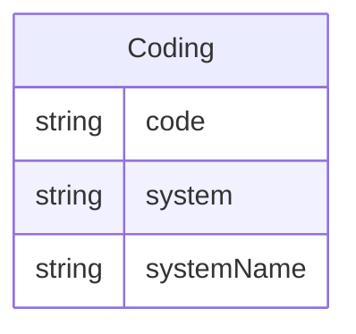

# Class: Coding 


URI: [cosmos_bc:class/Coding](https://www.cdisc.org/cosmos/biomedical_concept_v1.0class/Coding)





<!-- no inheritance hierarchy -->


## Slots

| Name | Cardinality and Range | Description | Inheritance |
| ---  | --- | --- | --- |
| [code](../slots/code.md) | 1 <br/> [String](../types/String.md) | Synonym concept for the Biomedical Concept as defined in a code system | direct |
| [system](../slots/system.md) | 1 <br/> [String](../types/String.md) | Identifies the code system for the synonym concept. The URL of the code system should be used if it exists | direct |
| [systemName](../slots/systemName.md) | 0..1 <br/> [String](../types/String.md) | Human-readable name for the code system | direct |


## Usages

| used by | used in | type | used |
| ---  | --- | --- | --- |
| [BiomedicalConcept](../classes/BiomedicalConcept.md) | [coding](../slots/coding.md) | range | [Coding](../classes/Coding.md) |


## Identifier and Mapping Information


### Schema Source


* from schema: https://www.cdisc.org/cosmos/biomedical_concept_v1.0


## Mappings

| Mapping Type | Mapped Value |
| ---  | ---  |
| self | cosmos_bc:Coding |
| native | cosmos_bc:Coding |


## LinkML Source

<!-- TODO: investigate https://stackoverflow.com/questions/37606292/how-to-create-tabbed-code-blocks-in-mkdocs-or-sphinx -->

### Direct

<details>
```yaml
name: Coding
from_schema: https://www.cdisc.org/cosmos/biomedical_concept_v1.0
slots:
- code
- system
- systemName

```
</details>

### Induced

<details>
```yaml
name: Coding
from_schema: https://www.cdisc.org/cosmos/biomedical_concept_v1.0
attributes:
  code:
    name: code
    description: Synonym concept for the Biomedical Concept as defined in a code system
    from_schema: https://www.cdisc.org/cosmos/biomedical_concept_v1.0
    rank: 1000
    alias: code
    owner: Coding
    domain_of:
    - Coding
    range: string
    required: true
  system:
    name: system
    description: Identifies the code system for the synonym concept. The URL of the
      code system should be used if it exists
    from_schema: https://www.cdisc.org/cosmos/biomedical_concept_v1.0
    rank: 1000
    alias: system
    owner: Coding
    domain_of:
    - Coding
    range: string
    required: true
  systemName:
    name: systemName
    description: Human-readable name for the code system
    from_schema: https://www.cdisc.org/cosmos/biomedical_concept_v1.0
    rank: 1000
    alias: systemName
    owner: Coding
    domain_of:
    - Coding
    range: string

```
</details>