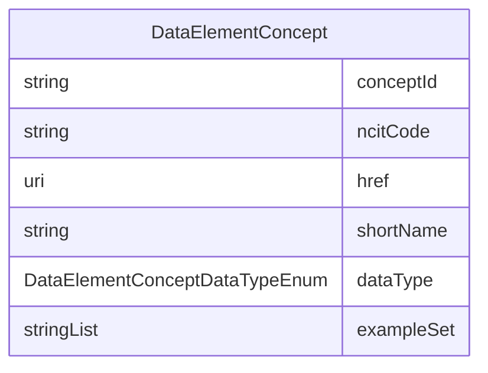

# Class: DataElementConcept 


URI: [cosmos_bc:class/DataElementConcept](https://www.cdisc.org/cosmos/biomedical_concept_v1.0class/DataElementConcept)





<!-- no inheritance hierarchy -->


## Slots

| Name | Cardinality and Range | Description | Inheritance |
| ---  | --- | --- | --- |
| [conceptId](../slots/conceptId.md) | 1 <br/> [String](../types/String.md) | An identifier for a Data Element Concept (DEC) which will be assigned as the NCIt code if it exists or a placeholder identifier if the concept is not yet available in NCIt | direct |
| [ncitCode](../slots/ncitCode.md) | 0..1 <br/> [String](../types/String.md) | NCI C-code for the BC Data Element Concept | direct |
| [href](../slots/href.md) | 0..1 <br/> [Uri](../types/Uri.md) | Link to NCIt for the Data Element Concept | direct |
| [shortName](../slots/shortName.md) | 1 <br/> [String](../types/String.md) | NCI Preferred Name for the concept; provisional name will be used if concept is not available in NCIt | direct |
| [dataType](../slots/dataType.md) | 1 <br/> [DataElementConceptDataTypeEnum](../enums/DataElementConceptDataTypeEnum.md) | Data Type for the Data Element Concept | direct |
| [exampleSet](../slots/exampleSet.md) | * <br/> [String](../types/String.md) | Example values for the Data Element Concept | direct |


## Usages

| used by | used in | type | used |
| ---  | --- | --- | --- |
| [BiomedicalConcept](../classes/BiomedicalConcept.md) | [dataElementConcepts](../slots/dataElementConcepts.md) | range | [DataElementConcept](../classes/DataElementConcept.md) |


## Identifier and Mapping Information


### Schema Source


* from schema: https://www.cdisc.org/cosmos/biomedical_concept_v1.0


## Mappings

| Mapping Type | Mapped Value |
| ---  | ---  |
| self | cosmos_bc:DataElementConcept |
| native | cosmos_bc:DataElementConcept |


## LinkML Source

<!-- TODO: investigate https://stackoverflow.com/questions/37606292/how-to-create-tabbed-code-blocks-in-mkdocs-or-sphinx -->

### Direct

<details>
```yaml
name: DataElementConcept
from_schema: https://www.cdisc.org/cosmos/biomedical_concept_v1.0
slots:
- conceptId
- ncitCode
- href
- shortName
- dataType
- exampleSet
slot_usage:
  conceptId:
    name: conceptId
    description: An identifier for a Data Element Concept (DEC) which will be assigned
      as the NCIt code if it exists or a placeholder identifier if the concept is
      not yet available in NCIt
  ncitCode:
    name: ncitCode
    description: NCI C-code for the BC Data Element Concept
  href:
    name: href
    description: Link to NCIt for the Data Element Concept

```
</details>

### Induced

<details>
```yaml
name: DataElementConcept
from_schema: https://www.cdisc.org/cosmos/biomedical_concept_v1.0
slot_usage:
  conceptId:
    name: conceptId
    description: An identifier for a Data Element Concept (DEC) which will be assigned
      as the NCIt code if it exists or a placeholder identifier if the concept is
      not yet available in NCIt
  ncitCode:
    name: ncitCode
    description: NCI C-code for the BC Data Element Concept
  href:
    name: href
    description: Link to NCIt for the Data Element Concept
attributes:
  conceptId:
    name: conceptId
    description: An identifier for a Data Element Concept (DEC) which will be assigned
      as the NCIt code if it exists or a placeholder identifier if the concept is
      not yet available in NCIt
    from_schema: https://www.cdisc.org/cosmos/biomedical_concept_v1.0
    rank: 1000
    identifier: true
    alias: conceptId
    owner: DataElementConcept
    domain_of:
    - BiomedicalConcept
    - DataElementConcept
    range: string
    required: true
    pattern: ^(C[0-9]+|NEW_[A-Z_]*[0-9]*)$
  ncitCode:
    name: ncitCode
    description: NCI C-code for the BC Data Element Concept
    from_schema: https://www.cdisc.org/cosmos/biomedical_concept_v1.0
    rank: 1000
    alias: ncitCode
    owner: DataElementConcept
    domain_of:
    - BiomedicalConcept
    - DataElementConcept
    range: string
    pattern: ^(C[0-9]+)$
  href:
    name: href
    description: Link to NCIt for the Data Element Concept
    from_schema: https://www.cdisc.org/cosmos/biomedical_concept_v1.0
    rank: 1000
    alias: href
    owner: DataElementConcept
    domain_of:
    - BiomedicalConcept
    - DataElementConcept
    range: uri
  shortName:
    name: shortName
    description: NCI Preferred Name for the concept; provisional name will be used
      if concept is not available in NCIt
    from_schema: https://www.cdisc.org/cosmos/biomedical_concept_v1.0
    rank: 1000
    alias: shortName
    owner: DataElementConcept
    domain_of:
    - BiomedicalConcept
    - DataElementConcept
    range: string
    required: true
  dataType:
    name: dataType
    description: Data Type for the Data Element Concept
    from_schema: https://www.cdisc.org/cosmos/biomedical_concept_v1.0
    rank: 1000
    alias: dataType
    owner: DataElementConcept
    domain_of:
    - DataElementConcept
    range: DataElementConceptDataTypeEnum
    required: true
  exampleSet:
    name: exampleSet
    description: Example values for the Data Element Concept
    from_schema: https://www.cdisc.org/cosmos/biomedical_concept_v1.0
    rank: 1000
    alias: exampleSet
    owner: DataElementConcept
    domain_of:
    - DataElementConcept
    range: string
    multivalued: true
    inlined: true
    inlined_as_list: true

```
</details>