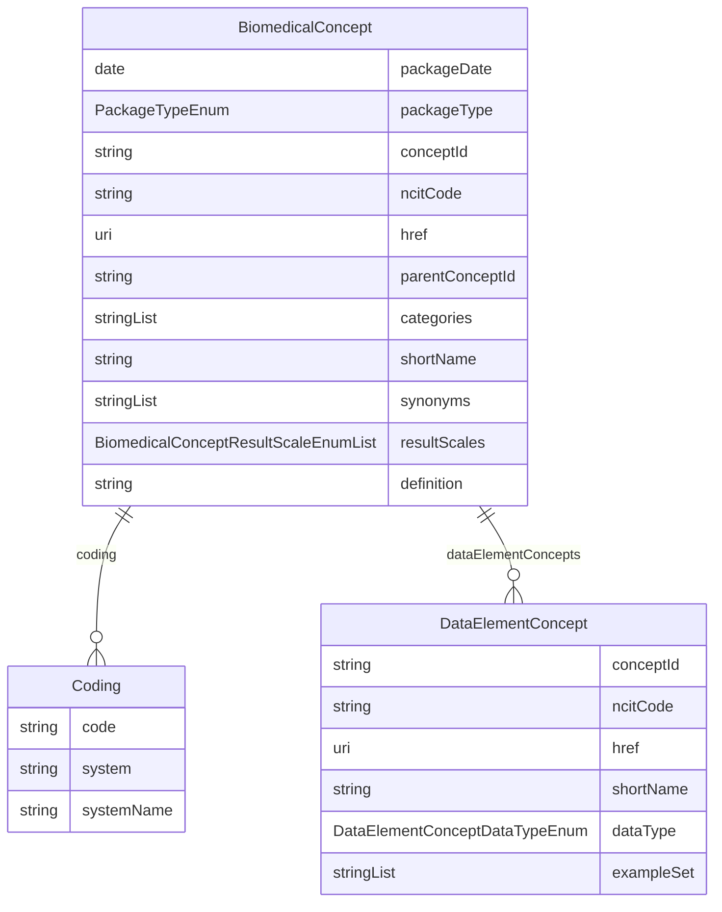

# COSMoS-Biomedical-Concepts-Schema

URI: https://www.cdisc.org/cosmos/biomedical_concept_v1.0

Name: COSMoS-Biomedical-Concepts-Schema

## Schema Diagram

## Classes

| Class | Description |
| --- | --- |
| [BiomedicalConcept](classes/BiomedicalConcept.md) |  |
| [Coding](classes/Coding.md) |  |
| [DataElementConcept](classes/DataElementConcept.md) |  |

## Slots

| Slot | Description |
| --- | --- |
| [conceptId](slots/conceptId.md) | An identifier that uniquely represents an entity |
| [ncitCode](slots/ncitCode.md) | NCIt code |
| [href](slots/href.md) | Link to NCIt for the Biomedical Concept |
| [packageDate](slots/packageDate.md) | Biomedical Concept package release date indicating when the BC package was published to production |
| [packageType](slots/packageType.md) | Package type (bc for Biomedical Concepts) |
| [categories](slots/categories.md) | Biomedical Concept category for the faciliation of API search and extract |
| [parentConceptId](slots/parentConceptId.md) | C-code for the parent concept in the NCIt hiearchy; blank if concept is not available in NCIt |
| [shortName](slots/shortName.md) | NCI Preferred Name for the concept; provisional name will be used if concept is not available in NCIt |
| [synonyms](slots/synonyms.md) | Biomedical Concept synonym equivalent to BC short name for the facilitation of API search and extraction |
| [resultScales](slots/resultScales.md) | Scale of measurement for the Biomedical Concept result |
| [definition](slots/definition.md) | NCIt definition for the Biomedical Concept; provisional defintion if concept is not available in NCIt |
| [coding](slots/coding.md) | Coding for the Biomedical Concept |
| [system](slots/system.md) | Identifies the code system for the synonym concept. The URL of the code system should be used if it exists |
| [systemName](slots/systemName.md) | Human-readable name for the code system |
| [code](slots/code.md) | Synonym concept for the Biomedical Concept as defined in a code system |
| [dataElementConcepts](slots/dataElementConcepts.md) | Data Element Concept |
| [dataType](slots/dataType.md) | Data Type for the Data Element Concept |
| [exampleSet](slots/exampleSet.md) | Example values for the Data Element Concept |

## Enumerations

| Enumeration | Description |
| --- | --- |
| [PackageTypeEnum](enums/PackageTypeEnum.md) |  |
| [BiomedicalConceptResultScaleEnum](enums/BiomedicalConceptResultScaleEnum.md) |  |
| [DataElementConceptDataTypeEnum](enums/DataElementConceptDataTypeEnum.md) |  |

## Types

| Type | Description |
| --- | --- |
| [String](types/String.md) | A character string |
| [Integer](types/Integer.md) | An integer |
| [Boolean](types/Boolean.md) | A binary (true or false) value |
| [Float](types/Float.md) | A real number that conforms to the xsd:float specification |
| [Double](types/Double.md) | A real number that conforms to the xsd:double specification |
| [Decimal](types/Decimal.md) | A real number with arbitrary precision that conforms to the xsd:decimal specification |
| [Time](types/Time.md) | A time object represents a (local) time of day, independent of any particular day |
| [Date](types/Date.md) | a date (year, month and day) in an idealized calendar |
| [Datetime](types/Datetime.md) | The combination of a date and time |
| [DateOrDatetime](types/DateOrDatetime.md) | Either a date or a datetime |
| [Uriorcurie](types/Uriorcurie.md) | a URI or a CURIE |
| [Curie](types/Curie.md) | a compact URI |
| [Uri](types/Uri.md) | a complete URI |
| [Ncname](types/Ncname.md) | Prefix part of CURIE |
| [Objectidentifier](types/Objectidentifier.md) | A URI or CURIE that represents an object in the model. |
| [Nodeidentifier](types/Nodeidentifier.md) | A URI, CURIE or BNODE that represents a node in a model. |
| [Jsonpointer](types/Jsonpointer.md) | A string encoding a JSON Pointer. The value of the string MUST conform to JSON Point syntax and SHOULD dereference to a valid object within the current instance document when encoded in tree form. |
| [Jsonpath](types/Jsonpath.md) | A string encoding a JSON Path. The value of the string MUST conform to JSON Point syntax and SHOULD dereference to zero or more valid objects within the current instance document when encoded in tree form. |
| [Sparqlpath](types/Sparqlpath.md) | A string encoding a SPARQL Property Path. The value of the string MUST conform to SPARQL syntax and SHOULD dereference to zero or more valid objects within the current instance document when encoded as RDF. |

## Subsets

| Subset | Description |
| --- | --- |
