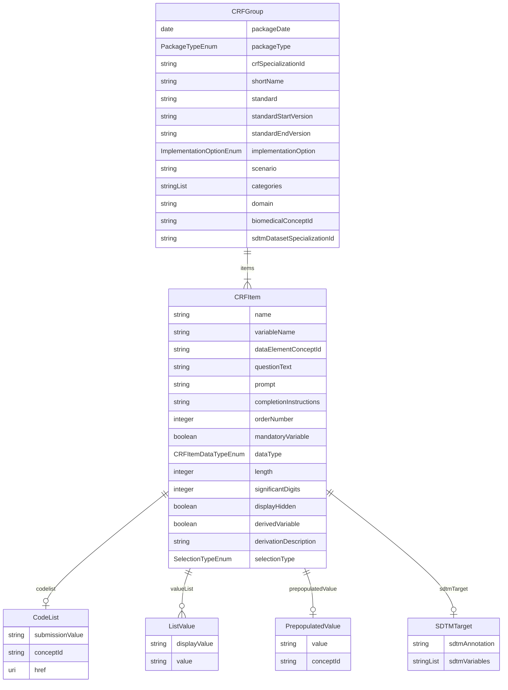

# Class: CRFGroup 


URI: [cosmos_crf:class/CRFGroup](https://www.cdisc.org/cosmos/crf_v1.0class/CRFGroup)





<!-- no inheritance hierarchy -->


## Slots

| Name | Cardinality and Range | Description | Inheritance |
| ---  | --- | --- | --- |
| [packageDate](../slots/packageDate.md) | 1 <br/> [Date](../types/Date.md) | Biomedical Concept package release date indicating when the BC package was published to production | direct |
| [packageType](../slots/packageType.md) | 1 <br/> [PackageTypeEnum](../enums/PackageTypeEnum.md) | Package type for CRF specializations (crf) | direct |
| [crfSpecializationId](../slots/crfSpecializationId.md) | 1 <br/> [String](../types/String.md) | Identifier for CRF specialization group | direct |
| [shortName](../slots/shortName.md) | 1 <br/> [String](../types/String.md) | Short name which provides a user friendly and intuitive name for the CRF group | direct |
| [standard](../slots/standard.md) | 1 <br/> [String](../types/String.md) | Standard for the CRF specialization group | direct |
| [standardStartVersion](../slots/standardStartVersion.md) | 1 <br/> [String](../types/String.md) | The earliest CRF IG version applicable to the CRF specialization | direct |
| [standardEndVersion](../slots/standardEndVersion.md) | 0..1 <br/> [String](../types/String.md) | The last CRF IG version that is applicable to the CRF specialization | direct |
| [implementationOption](../slots/implementationOption.md) | 0..1 <br/> [ImplementationOptionEnum](../enums/ImplementationOptionEnum.md) | Implementation option for the CRF specialization group | direct |
| [scenario](../slots/scenario.md) | 0..1 <br/> [String](../types/String.md) | Scenario for the CRF specialization group | direct |
| [categories](../slots/categories.md) | * <br/> [String](../types/String.md) | CRF Dataset Specialization category for the faciliation of API search and extract | direct |
| [domain](../slots/domain.md) | 0..1 <br/> [String](../types/String.md) | Domain for the CRF specialization group | direct |
| [biomedicalConceptId](../slots/biomedicalConceptId.md) | 0..1 _recommended_ <br/> [String](../types/String.md) | Biomedical Concept identifier foreign key | direct |
| [sdtmDatasetSpecializationId](../slots/sdtmDatasetSpecializationId.md) | 0..1 <br/> [String](../types/String.md) | Identifier for SDTM Dataset Specialization group | direct |
| [items](../slots/items.md) | 1..* <br/> [CRFItem](../classes/CRFItem.md) | Items included in the CRF specialization | direct |


## Identifier and Mapping Information


### Schema Source


* from schema: https://www.cdisc.org/cosmos/crf_v1.0


## Mappings

| Mapping Type | Mapped Value |
| ---  | ---  |
| self | cosmos_crf:CRFGroup |
| native | cosmos_crf:CRFGroup |


## LinkML Source

<!-- TODO: investigate https://stackoverflow.com/questions/37606292/how-to-create-tabbed-code-blocks-in-mkdocs-or-sphinx -->

### Direct

<details>
```yaml
name: CRFGroup
from_schema: https://www.cdisc.org/cosmos/crf_v1.0
slots:
- packageDate
- packageType
- crfSpecializationId
- shortName
- standard
- standardStartVersion
- standardEndVersion
- implementationOption
- scenario
- categories
- domain
- biomedicalConceptId
- sdtmDatasetSpecializationId
- items
tree_root: true

```
</details>

### Induced

<details>
```yaml
name: CRFGroup
from_schema: https://www.cdisc.org/cosmos/crf_v1.0
attributes:
  packageDate:
    name: packageDate
    description: Biomedical Concept package release date indicating when the BC package
      was published to production
    from_schema: https://www.cdisc.org/cosmos/crf_v1.0
    aliases:
    - package_date
    rank: 1000
    alias: packageDate
    owner: CRFGroup
    domain_of:
    - CRFGroup
    range: date
    required: true
  packageType:
    name: packageType
    description: Package type for CRF specializations (crf)
    from_schema: https://www.cdisc.org/cosmos/crf_v1.0
    aliases:
    - package_type
    rank: 1000
    alias: packageType
    owner: CRFGroup
    domain_of:
    - CRFGroup
    range: PackageTypeEnum
    required: true
  crfSpecializationId:
    name: crfSpecializationId
    description: Identifier for CRF specialization group
    from_schema: https://www.cdisc.org/cosmos/crf_v1.0
    aliases:
    - crf_group_id
    rank: 1000
    identifier: true
    alias: crfSpecializationId
    owner: CRFGroup
    domain_of:
    - CRFGroup
    range: string
    required: true
    pattern: ^[A-Z][A-Z0-9_]*$
  shortName:
    name: shortName
    description: Short name which provides a user friendly and intuitive name for
      the CRF group
    from_schema: https://www.cdisc.org/cosmos/crf_v1.0
    aliases:
    - short_name
    rank: 1000
    alias: shortName
    owner: CRFGroup
    domain_of:
    - CRFGroup
    range: string
    required: true
  standard:
    name: standard
    description: Standard for the CRF specialization group
    from_schema: https://www.cdisc.org/cosmos/crf_v1.0
    aliases:
    - standard
    rank: 1000
    alias: standard
    owner: CRFGroup
    domain_of:
    - CRFGroup
    range: string
    required: true
  standardStartVersion:
    name: standardStartVersion
    description: The earliest CRF IG version applicable to the CRF specialization
    from_schema: https://www.cdisc.org/cosmos/crf_v1.0
    aliases:
    - standard_start_version
    rank: 1000
    alias: standardStartVersion
    owner: CRFGroup
    domain_of:
    - CRFGroup
    range: string
    required: true
  standardEndVersion:
    name: standardEndVersion
    description: The last CRF IG version that is applicable to the CRF specialization
    from_schema: https://www.cdisc.org/cosmos/crf_v1.0
    aliases:
    - standard_end_version
    rank: 1000
    alias: standardEndVersion
    owner: CRFGroup
    domain_of:
    - CRFGroup
    range: string
  implementationOption:
    name: implementationOption
    description: Implementation option for the CRF specialization group
    from_schema: https://www.cdisc.org/cosmos/crf_v1.0
    aliases:
    - implementation_option
    rank: 1000
    alias: implementationOption
    owner: CRFGroup
    domain_of:
    - CRFGroup
    range: ImplementationOptionEnum
  scenario:
    name: scenario
    description: Scenario for the CRF specialization group
    from_schema: https://www.cdisc.org/cosmos/crf_v1.0
    aliases:
    - scenario
    rank: 1000
    alias: scenario
    owner: CRFGroup
    domain_of:
    - CRFGroup
    range: string
  categories:
    name: categories
    description: CRF Dataset Specialization category for the faciliation of API search
      and extract
    from_schema: https://www.cdisc.org/cosmos/crf_v1.0
    rank: 1000
    alias: categories
    owner: CRFGroup
    domain_of:
    - CRFGroup
    range: string
    multivalued: true
    inlined: true
    inlined_as_list: true
  domain:
    name: domain
    description: Domain for the CRF specialization group
    from_schema: https://www.cdisc.org/cosmos/crf_v1.0
    rank: 1000
    alias: domain
    owner: CRFGroup
    domain_of:
    - CRFGroup
    range: string
  biomedicalConceptId:
    name: biomedicalConceptId
    description: Biomedical Concept identifier foreign key
    from_schema: https://www.cdisc.org/cosmos/crf_v1.0
    aliases:
    - bc_id
    rank: 1000
    alias: biomedicalConceptId
    owner: CRFGroup
    domain_of:
    - CRFGroup
    range: string
    recommended: true
    pattern: ^(C[0-9]+|NEW_[A-Z]*[0-9]*)$
  sdtmDatasetSpecializationId:
    name: sdtmDatasetSpecializationId
    description: Identifier for SDTM Dataset Specialization group
    from_schema: https://www.cdisc.org/cosmos/crf_v1.0
    aliases:
    - vlm_group_id
    rank: 1000
    alias: sdtmDatasetSpecializationId
    owner: CRFGroup
    domain_of:
    - CRFGroup
    range: string
    pattern: ^[A-Z][A-Z0-9_]*$
  items:
    name: items
    description: Items included in the CRF specialization
    from_schema: https://www.cdisc.org/cosmos/crf_v1.0
    rank: 1000
    alias: items
    owner: CRFGroup
    domain_of:
    - CRFGroup
    range: CRFItem
    required: true
    multivalued: true
    inlined: true
    inlined_as_list: true
tree_root: true

```
</details>