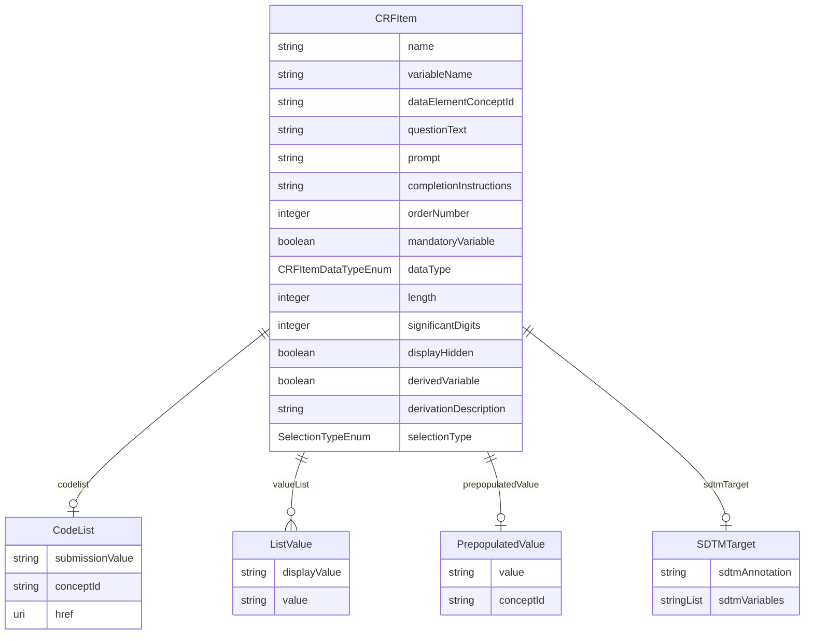

# Class: CRFItem 


URI: [cosmos_crf:class/CRFItem](https://www.cdisc.org/cosmos/crf_v1.0class/CRFItem)





<!-- no inheritance hierarchy -->


## Slots

| Name | Cardinality and Range | Description | Inheritance |
| ---  | --- | --- | --- |
| [name](../slots/name.md) | 1 <br/> [String](../types/String.md) | Item name as it appears on the CRF instrument | direct |
| [variableName](../slots/variableName.md) | 1 <br/> [String](../types/String.md) | Variable name of the CRF item for which data are being collected. | direct |
| [dataElementConceptId](../slots/dataElementConceptId.md) | 0..1 <br/> [String](../types/String.md) | Biomedical Concept Data Element Concept identifier foreign key | direct |
| [questionText](../slots/questionText.md) | 0..1 <br/> [String](../types/String.md) | Item question text | direct |
| [prompt](../slots/prompt.md) | 0..1 <br/> [String](../types/String.md) | Item prompt | direct |
| [completionInstructions](../slots/completionInstructions.md) | 0..1 <br/> [String](../types/String.md) | Item completion instructions for the clinical site on how to enter collected information on the CRF | direct |
| [orderNumber](../slots/orderNumber.md) | 1 <br/> [Integer](../types/Integer.md) | Item order number | direct |
| [mandatoryVariable](../slots/mandatoryVariable.md) | 1 <br/> [Boolean](../types/Boolean.md) | Indicator that the item must be present within the CRF group | direct |
| [dataType](../slots/dataType.md) | 1 <br/> [CRFItemDataTypeEnum](../enums/CRFItemDataTypeEnum.md) | Item data type | direct |
| [length](../slots/length.md) | 0..1 <br/> [Integer](../types/Integer.md) | Item length | direct |
| [significantDigits](../slots/significantDigits.md) | 0..1 <br/> [Integer](../types/Integer.md) | Item significant_digits | direct |
| [displayHidden](../slots/displayHidden.md) | 0..1 <br/> [Boolean](../types/Boolean.md) | Indicator that the item is hidden from the user | direct |
| [derivedVariable](../slots/derivedVariable.md) | 0..1 <br/> [Boolean](../types/Boolean.md) | Indicator that variable is derived | direct |
| [derivationDescription](../slots/derivationDescription.md) | 0..1 <br/> [String](../types/String.md) | Description of the derivation. Required when derivedVariable is true. | direct |
| [codelist](../slots/codelist.md) | 0..1 <br/> [CodeList](../classes/CodeList.md) | Codelist | direct |
| [valueList](../slots/valueList.md) | * <br/> [ListValue](../classes/ListValue.md) | A set of values for a CRF item | direct |
| [selectionType](../slots/selectionType.md) | 0..1 <br/> [SelectionTypeEnum](../enums/SelectionTypeEnum.md) | Type of selection used for set-up of the CRF instrument | direct |
| [prepopulatedValue](../slots/prepopulatedValue.md) | 0..1 <br/> [PrepopulatedValue](../classes/PrepopulatedValue.md) | Pre-populated value for the CRF instrument | direct |
| [sdtmTarget](../slots/sdtmTarget.md) | 0..1 <br/> [SDTMTarget](../classes/SDTMTarget.md) | SDTM target variables for CRF item variable | direct |


## Usages

| used by | used in | type | used |
| ---  | --- | --- | --- |
| [CRFGroup](../classes/CRFGroup.md) | [items](../slots/items.md) | range | [CRFItem](../classes/CRFItem.md) |


## Identifier and Mapping Information


### Schema Source


* from schema: https://www.cdisc.org/cosmos/crf_v1.0


## Mappings

| Mapping Type | Mapped Value |
| ---  | ---  |
| self | cosmos_crf:CRFItem |
| native | cosmos_crf:CRFItem |


## LinkML Source

<!-- TODO: investigate https://stackoverflow.com/questions/37606292/how-to-create-tabbed-code-blocks-in-mkdocs-or-sphinx -->

### Direct

<details>
```yaml
name: CRFItem
from_schema: https://www.cdisc.org/cosmos/crf_v1.0
slots:
- name
- variableName
- dataElementConceptId
- questionText
- prompt
- completionInstructions
- orderNumber
- mandatoryVariable
- dataType
- length
- significantDigits
- displayHidden
- derivedVariable
- derivationDescription
- codelist
- valueList
- selectionType
- prepopulatedValue
- sdtmTarget

```
</details>

### Induced

<details>
```yaml
name: CRFItem
from_schema: https://www.cdisc.org/cosmos/crf_v1.0
attributes:
  name:
    name: name
    description: Item name as it appears on the CRF instrument
    from_schema: https://www.cdisc.org/cosmos/crf_v1.0
    aliases:
    - crf_item
    rank: 1000
    identifier: true
    alias: name
    owner: CRFItem
    domain_of:
    - CRFItem
    range: string
    required: true
    pattern: ^[A-Z][A-Z0-9_]*$
  variableName:
    name: variableName
    description: Variable name of the CRF item for which data are being collected.
    from_schema: https://www.cdisc.org/cosmos/crf_v1.0
    aliases:
    - variable_name
    rank: 1000
    alias: variableName
    owner: CRFItem
    domain_of:
    - CRFItem
    range: string
    required: true
    pattern: ^[A-Z][A-Z0-9_]*$
  dataElementConceptId:
    name: dataElementConceptId
    description: Biomedical Concept Data Element Concept identifier foreign key
    from_schema: https://www.cdisc.org/cosmos/crf_v1.0
    aliases:
    - dec_id
    rank: 1000
    alias: dataElementConceptId
    owner: CRFItem
    domain_of:
    - CRFItem
    range: string
    pattern: ^(C[0-9]+|NEW_[A-Z]*[0-9]*)$
  questionText:
    name: questionText
    description: Item question text
    from_schema: https://www.cdisc.org/cosmos/crf_v1.0
    aliases:
    - question_text
    rank: 1000
    alias: questionText
    owner: CRFItem
    domain_of:
    - CRFItem
    range: string
  prompt:
    name: prompt
    description: Item prompt
    from_schema: https://www.cdisc.org/cosmos/crf_v1.0
    aliases:
    - prompt
    rank: 1000
    alias: prompt
    owner: CRFItem
    domain_of:
    - CRFItem
    range: string
  completionInstructions:
    name: completionInstructions
    description: Item completion instructions for the clinical site on how to enter
      collected information on the CRF
    from_schema: https://www.cdisc.org/cosmos/crf_v1.0
    aliases:
    - completion_instructions
    rank: 1000
    alias: completionInstructions
    owner: CRFItem
    domain_of:
    - CRFItem
    range: string
  orderNumber:
    name: orderNumber
    description: Item order number
    from_schema: https://www.cdisc.org/cosmos/crf_v1.0
    aliases:
    - order_number
    rank: 1000
    alias: orderNumber
    owner: CRFItem
    domain_of:
    - CRFItem
    range: integer
    required: true
  mandatoryVariable:
    name: mandatoryVariable
    description: Indicator that the item must be present within the CRF group
    from_schema: https://www.cdisc.org/cosmos/crf_v1.0
    aliases:
    - mandatory_variable
    rank: 1000
    alias: mandatoryVariable
    owner: CRFItem
    domain_of:
    - CRFItem
    range: boolean
    required: true
  dataType:
    name: dataType
    description: Item data type
    from_schema: https://www.cdisc.org/cosmos/crf_v1.0
    aliases:
    - data_type
    rank: 1000
    alias: dataType
    owner: CRFItem
    domain_of:
    - CRFItem
    range: CRFItemDataTypeEnum
    required: true
  length:
    name: length
    description: Item length
    from_schema: https://www.cdisc.org/cosmos/crf_v1.0
    aliases:
    - length
    rank: 1000
    alias: length
    owner: CRFItem
    domain_of:
    - CRFItem
    range: integer
    minimum_value: 1
  significantDigits:
    name: significantDigits
    description: Item significant_digits
    from_schema: https://www.cdisc.org/cosmos/crf_v1.0
    aliases:
    - significant_digits
    rank: 1000
    alias: significantDigits
    owner: CRFItem
    domain_of:
    - CRFItem
    range: integer
  displayHidden:
    name: displayHidden
    description: Indicator that the item is hidden from the user
    from_schema: https://www.cdisc.org/cosmos/crf_v1.0
    aliases:
    - display_hidden
    rank: 1000
    alias: displayHidden
    owner: CRFItem
    domain_of:
    - CRFItem
    range: boolean
  derivedVariable:
    name: derivedVariable
    description: Indicator that variable is derived
    from_schema: https://www.cdisc.org/cosmos/crf_v1.0
    rank: 1000
    alias: derivedVariable
    owner: CRFItem
    domain_of:
    - CRFItem
    range: boolean
  derivationDescription:
    name: derivationDescription
    description: Description of the derivation. Required when derivedVariable is true.
    from_schema: https://www.cdisc.org/cosmos/crf_v1.0
    rank: 1000
    alias: derivationDescription
    owner: CRFItem
    domain_of:
    - CRFItem
    range: string
  codelist:
    name: codelist
    description: Codelist
    from_schema: https://www.cdisc.org/cosmos/crf_v1.0
    rank: 1000
    alias: codelist
    owner: CRFItem
    domain_of:
    - CRFItem
    range: CodeList
    inlined: true
  valueList:
    name: valueList
    description: A set of values for a CRF item
    from_schema: https://www.cdisc.org/cosmos/crf_v1.0
    rank: 1000
    alias: valueList
    owner: CRFItem
    domain_of:
    - CRFItem
    range: ListValue
    multivalued: true
    inlined: true
    inlined_as_list: true
  selectionType:
    name: selectionType
    description: Type of selection used for set-up of the CRF instrument
    from_schema: https://www.cdisc.org/cosmos/crf_v1.0
    aliases:
    - selection_type
    rank: 1000
    alias: selectionType
    owner: CRFItem
    domain_of:
    - CRFItem
    range: SelectionTypeEnum
  prepopulatedValue:
    name: prepopulatedValue
    description: Pre-populated value for the CRF instrument
    from_schema: https://www.cdisc.org/cosmos/crf_v1.0
    rank: 1000
    alias: prepopulatedValue
    owner: CRFItem
    domain_of:
    - CRFItem
    range: PrepopulatedValue
  sdtmTarget:
    name: sdtmTarget
    description: SDTM target variables for CRF item variable
    from_schema: https://www.cdisc.org/cosmos/crf_v1.0
    rank: 1000
    alias: sdtmTarget
    owner: CRFItem
    domain_of:
    - CRFItem
    range: SDTMTarget

```
</details>