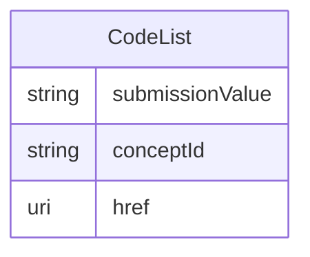

# Class: CodeList 


URI: [cosmos_crf:class/CodeList](https://www.cdisc.org/cosmos/crf_v1.0class/CodeList)





<!-- no inheritance hierarchy -->


## Slots

| Name | Cardinality and Range | Description | Inheritance |
| ---  | --- | --- | --- |
| [submissionValue](../slots/submissionValue.md) | 1 <br/> [String](../types/String.md) | CDISC submission value for the codelist | direct |
| [conceptId](../slots/conceptId.md) | 0..1 <br/> [String](../types/String.md) | C-code for codelist in NCIt | direct |
| [href](../slots/href.md) | 0..1 <br/> [Uri](../types/Uri.md) | Link to NCIt for the codelist | direct |


## Usages

| used by | used in | type | used |
| ---  | --- | --- | --- |
| [CRFItem](../classes/CRFItem.md) | [codelist](../slots/codelist.md) | range | [CodeList](../classes/CodeList.md) |


## Identifier and Mapping Information


### Schema Source


* from schema: https://www.cdisc.org/cosmos/crf_v1.0


## Mappings

| Mapping Type | Mapped Value |
| ---  | ---  |
| self | cosmos_crf:CodeList |
| native | cosmos_crf:CodeList |


## LinkML Source

<!-- TODO: investigate https://stackoverflow.com/questions/37606292/how-to-create-tabbed-code-blocks-in-mkdocs-or-sphinx -->

### Direct

<details>
```yaml
name: CodeList
from_schema: https://www.cdisc.org/cosmos/crf_v1.0
slots:
- submissionValue
- conceptId
- href
slot_usage:
  submissionValue:
    name: submissionValue
    description: CDISC submission value for the codelist
    aliases:
    - codelist_submission_value
    required: true
  conceptId:
    name: conceptId
    description: C-code for codelist in NCIt
    aliases:
    - codelist
  href:
    name: href
    description: Link to NCIt for the codelist
    aliases:
    - codelist_uri

```
</details>

### Induced

<details>
```yaml
name: CodeList
from_schema: https://www.cdisc.org/cosmos/crf_v1.0
slot_usage:
  submissionValue:
    name: submissionValue
    description: CDISC submission value for the codelist
    aliases:
    - codelist_submission_value
    required: true
  conceptId:
    name: conceptId
    description: C-code for codelist in NCIt
    aliases:
    - codelist
  href:
    name: href
    description: Link to NCIt for the codelist
    aliases:
    - codelist_uri
attributes:
  submissionValue:
    name: submissionValue
    description: CDISC submission value for the codelist
    from_schema: https://www.cdisc.org/cosmos/crf_v1.0
    aliases:
    - codelist_submission_value
    rank: 1000
    alias: submissionValue
    owner: CodeList
    domain_of:
    - CodeList
    range: string
    required: true
    pattern: ^[A-Z][A-Z0-9_]*$
  conceptId:
    name: conceptId
    description: C-code for codelist in NCIt
    from_schema: https://www.cdisc.org/cosmos/crf_v1.0
    aliases:
    - codelist
    rank: 1000
    alias: conceptId
    owner: CodeList
    domain_of:
    - PrepopulatedValue
    - CodeList
    range: string
    pattern: ^(C[0-9]+)$
  href:
    name: href
    description: Link to NCIt for the codelist
    from_schema: https://www.cdisc.org/cosmos/crf_v1.0
    aliases:
    - codelist_uri
    rank: 1000
    alias: href
    owner: CodeList
    domain_of:
    - CodeList
    range: uri

```
</details>