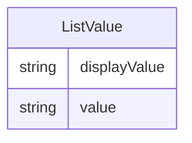

# Class: ListValue 


URI: [cosmos_crf:class/ListValue](https://www.cdisc.org/cosmos/crf_v1.0class/ListValue)





<!-- no inheritance hierarchy -->


## Slots

| Name | Cardinality and Range | Description | Inheritance |
| ---  | --- | --- | --- |
| [displayValue](../slots/displayValue.md) | 1 <br/> [String](../types/String.md) | CDISC submission value for the CRF item | direct |
| [value](../slots/value.md) | 0..1 <br/> [String](../types/String.md) | User-friendly display value for the CRF item | direct |


## Usages

| used by | used in | type | used |
| ---  | --- | --- | --- |
| [CRFItem](../classes/CRFItem.md) | [valueList](../slots/valueList.md) | range | [ListValue](../classes/ListValue.md) |


## Identifier and Mapping Information


### Schema Source


* from schema: https://www.cdisc.org/cosmos/crf_v1.0


## Mappings

| Mapping Type | Mapped Value |
| ---  | ---  |
| self | cosmos_crf:ListValue |
| native | cosmos_crf:ListValue |


## LinkML Source

<!-- TODO: investigate https://stackoverflow.com/questions/37606292/how-to-create-tabbed-code-blocks-in-mkdocs-or-sphinx -->

### Direct

<details>
```yaml
name: ListValue
from_schema: https://www.cdisc.org/cosmos/crf_v1.0
slots:
- displayValue
- value
slot_usage:
  displayValue:
    name: displayValue
    description: CDISC submission value for the CRF item
    aliases:
    - value_display_list
    required: true
  value:
    name: value
    description: User-friendly display value for the CRF item
    aliases:
    - value_list
    required: false

```
</details>

### Induced

<details>
```yaml
name: ListValue
from_schema: https://www.cdisc.org/cosmos/crf_v1.0
slot_usage:
  displayValue:
    name: displayValue
    description: CDISC submission value for the CRF item
    aliases:
    - value_display_list
    required: true
  value:
    name: value
    description: User-friendly display value for the CRF item
    aliases:
    - value_list
    required: false
attributes:
  displayValue:
    name: displayValue
    description: CDISC submission value for the CRF item
    from_schema: https://www.cdisc.org/cosmos/crf_v1.0
    aliases:
    - value_display_list
    rank: 1000
    alias: displayValue
    owner: ListValue
    domain_of:
    - ListValue
    range: string
    required: true
  value:
    name: value
    description: User-friendly display value for the CRF item
    from_schema: https://www.cdisc.org/cosmos/crf_v1.0
    aliases:
    - value_list
    rank: 1000
    alias: value
    owner: ListValue
    domain_of:
    - ListValue
    - PrepopulatedValue
    range: string
    required: false

```
</details>