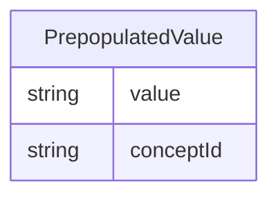

# Class: PrepopulatedValue 


URI: [cosmos_crf:class/PrepopulatedValue](https://www.cdisc.org/cosmos/crf_v1.0class/PrepopulatedValue)





<!-- no inheritance hierarchy -->


## Slots

| Name | Cardinality and Range | Description | Inheritance |
| ---  | --- | --- | --- |
| [value](../slots/value.md) | 1 <br/> [String](../types/String.md) | Submission value for pre-populated term in NCIt | direct |
| [conceptId](../slots/conceptId.md) | 0..1 <br/> [String](../types/String.md) | C-code for pre-populated term in NCIt | direct |


## Usages

| used by | used in | type | used |
| ---  | --- | --- | --- |
| [CRFItem](../classes/CRFItem.md) | [prepopulatedValue](../slots/prepopulatedValue.md) | range | [PrepopulatedValue](../classes/PrepopulatedValue.md) |


## Identifier and Mapping Information


### Schema Source


* from schema: https://www.cdisc.org/cosmos/crf_v1.0


## Mappings

| Mapping Type | Mapped Value |
| ---  | ---  |
| self | cosmos_crf:PrepopulatedValue |
| native | cosmos_crf:PrepopulatedValue |


## LinkML Source

<!-- TODO: investigate https://stackoverflow.com/questions/37606292/how-to-create-tabbed-code-blocks-in-mkdocs-or-sphinx -->

### Direct

<details>
```yaml
name: PrepopulatedValue
from_schema: https://www.cdisc.org/cosmos/crf_v1.0
slots:
- value
- conceptId
slot_usage:
  value:
    name: value
    description: Submission value for pre-populated term in NCIt
    aliases:
    - prepopulated_term
    required: true
  conceptId:
    name: conceptId
    description: C-code for pre-populated term in NCIt
    aliases:
    - prepopulated_code
    required: false

```
</details>

### Induced

<details>
```yaml
name: PrepopulatedValue
from_schema: https://www.cdisc.org/cosmos/crf_v1.0
slot_usage:
  value:
    name: value
    description: Submission value for pre-populated term in NCIt
    aliases:
    - prepopulated_term
    required: true
  conceptId:
    name: conceptId
    description: C-code for pre-populated term in NCIt
    aliases:
    - prepopulated_code
    required: false
attributes:
  value:
    name: value
    description: Submission value for pre-populated term in NCIt
    from_schema: https://www.cdisc.org/cosmos/crf_v1.0
    aliases:
    - prepopulated_term
    rank: 1000
    alias: value
    owner: PrepopulatedValue
    domain_of:
    - ListValue
    - PrepopulatedValue
    range: string
    required: true
  conceptId:
    name: conceptId
    description: C-code for pre-populated term in NCIt
    from_schema: https://www.cdisc.org/cosmos/crf_v1.0
    aliases:
    - prepopulated_code
    rank: 1000
    alias: conceptId
    owner: PrepopulatedValue
    domain_of:
    - PrepopulatedValue
    - CodeList
    range: string
    required: false
    pattern: ^(C[0-9]+)$

```
</details>