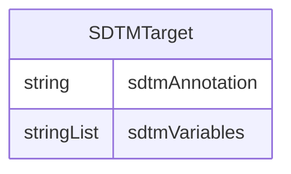

# Class: SDTMTarget 


URI: [cosmos_crf:class/SDTMTarget](https://www.cdisc.org/cosmos/crf_v1.0class/SDTMTarget)





<!-- no inheritance hierarchy -->


## Slots

| Name | Cardinality and Range | Description | Inheritance |
| ---  | --- | --- | --- |
| [sdtmAnnotation](../slots/sdtmAnnotation.md) | 0..1 _recommended_ <br/> [String](../types/String.md) | Annotation of the SDTM target in the CRF instrument | direct |
| [sdtmVariables](../slots/sdtmVariables.md) | * <br/> [String](../types/String.md) | SDTM target variable for CRF item variable | direct |


## Usages

| used by | used in | type | used |
| ---  | --- | --- | --- |
| [CRFItem](../classes/CRFItem.md) | [sdtmTarget](../slots/sdtmTarget.md) | range | [SDTMTarget](../classes/SDTMTarget.md) |


## Identifier and Mapping Information


### Schema Source


* from schema: https://www.cdisc.org/cosmos/crf_v1.0


## Mappings

| Mapping Type | Mapped Value |
| ---  | ---  |
| self | cosmos_crf:SDTMTarget |
| native | cosmos_crf:SDTMTarget |


## LinkML Source

<!-- TODO: investigate https://stackoverflow.com/questions/37606292/how-to-create-tabbed-code-blocks-in-mkdocs-or-sphinx -->

### Direct

<details>
```yaml
name: SDTMTarget
from_schema: https://www.cdisc.org/cosmos/crf_v1.0
slots:
- sdtmAnnotation
- sdtmVariables

```
</details>

### Induced

<details>
```yaml
name: SDTMTarget
from_schema: https://www.cdisc.org/cosmos/crf_v1.0
attributes:
  sdtmAnnotation:
    name: sdtmAnnotation
    description: Annotation of the SDTM target in the CRF instrument
    from_schema: https://www.cdisc.org/cosmos/crf_v1.0
    aliases:
    - sdtm_annotation
    rank: 1000
    alias: sdtmAnnotation
    owner: SDTMTarget
    domain_of:
    - SDTMTarget
    range: string
    recommended: true
  sdtmVariables:
    name: sdtmVariables
    description: SDTM target variable for CRF item variable
    from_schema: https://www.cdisc.org/cosmos/crf_v1.0
    aliases:
    - sdtm_target_variable
    rank: 1000
    alias: sdtmVariables
    owner: SDTMTarget
    domain_of:
    - SDTMTarget
    range: string
    multivalued: true
    inlined: true
    inlined_as_list: true

```
</details>