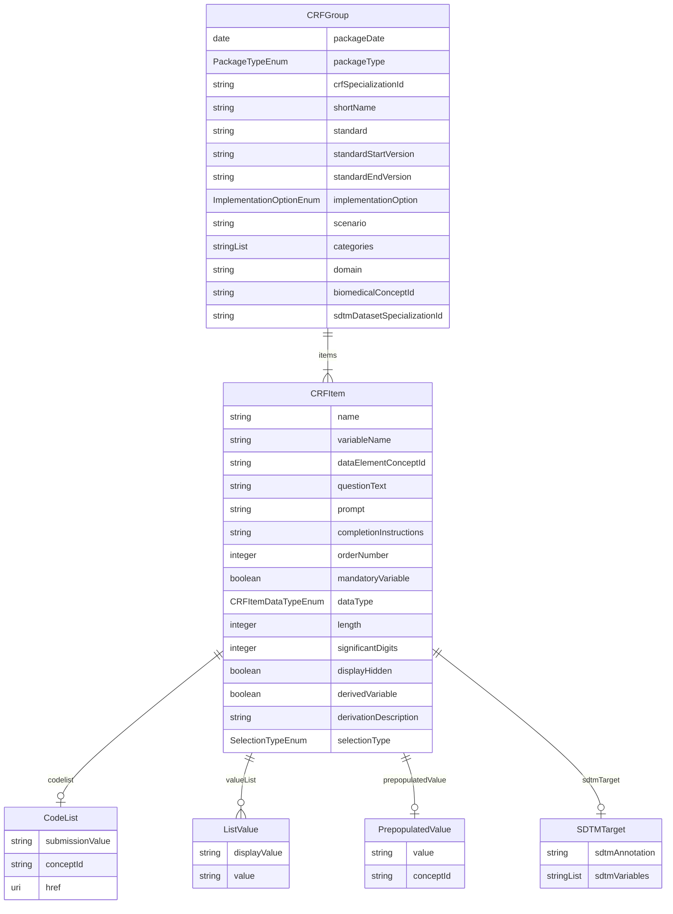

# COSMoS-Biomedical-Concepts-CRF-Schema

URI: https://www.cdisc.org/cosmos/crf_v1.0

Name: COSMoS-Biomedical-Concepts-CRF-Schema

## Schema Diagram

## Classes

| Class | Description |
| --- | --- |
| [CodeList](classes/CodeList.md) |  |
| [CRFGroup](classes/CRFGroup.md) |  |
| [CRFItem](classes/CRFItem.md) |  |
| [ListValue](classes/ListValue.md) |  |
| [PrepopulatedValue](classes/PrepopulatedValue.md) |  |
| [SDTMTarget](classes/SDTMTarget.md) |  |

## Slots

| Slot | Description |
| --- | --- |
| [packageDate](slots/packageDate.md) | Biomedical Concept package release date indicating when the BC package was published to production |
| [packageType](slots/packageType.md) | Package type for CRF specializations (crf) |
| [crfSpecializationId](slots/crfSpecializationId.md) | Identifier for CRF specialization group |
| [shortName](slots/shortName.md) | Short name which provides a user friendly and intuitive name for the CRF group |
| [standard](slots/standard.md) | Standard for the CRF specialization group |
| [standardStartVersion](slots/standardStartVersion.md) | The earliest CRF IG version applicable to the CRF specialization |
| [standardEndVersion](slots/standardEndVersion.md) | The last CRF IG version that is applicable to the CRF specialization |
| [implementationOption](slots/implementationOption.md) | Implementation option for the CRF specialization group |
| [scenario](slots/scenario.md) | Scenario for the CRF specialization group |
| [categories](slots/categories.md) | CRF Dataset Specialization category for the faciliation of API search and extract |
| [domain](slots/domain.md) | Domain for the CRF specialization group |
| [biomedicalConceptId](slots/biomedicalConceptId.md) | Biomedical Concept identifier foreign key |
| [sdtmDatasetSpecializationId](slots/sdtmDatasetSpecializationId.md) | Identifier for SDTM Dataset Specialization group |
| [items](slots/items.md) | Items included in the CRF specialization |
| [name](slots/name.md) | Item name as it appears on the CRF instrument |
| [variableName](slots/variableName.md) | Variable name of the CRF item for which data are being collected. |
| [dataElementConceptId](slots/dataElementConceptId.md) | Biomedical Concept Data Element Concept identifier foreign key |
| [questionText](slots/questionText.md) | Item question text |
| [prompt](slots/prompt.md) | Item prompt |
| [completionInstructions](slots/completionInstructions.md) | Item completion instructions for the clinical site on how to enter collected information on the CRF |
| [orderNumber](slots/orderNumber.md) | Item order number |
| [mandatoryVariable](slots/mandatoryVariable.md) | Indicator that the item must be present within the CRF group |
| [dataType](slots/dataType.md) | Item data type |
| [length](slots/length.md) | Item length |
| [significantDigits](slots/significantDigits.md) | Item significant_digits |
| [displayHidden](slots/displayHidden.md) | Indicator that the item is hidden from the user |
| [derivedVariable](slots/derivedVariable.md) | Indicator that variable is derived |
| [derivationDescription](slots/derivationDescription.md) | Description of the derivation. Required when derivedVariable is true. |
| [codelist](slots/codelist.md) | Codelist |
| [valueList](slots/valueList.md) | A set of values for a CRF item |
| [selectionType](slots/selectionType.md) | Type of selection used for set-up of the CRF instrument |
| [prepopulatedValue](slots/prepopulatedValue.md) | Pre-populated value for the CRF instrument |
| [conceptId](slots/conceptId.md) | C-code for codelist or term in NCIt |
| [href](slots/href.md) | Link to NCIt for the codelist or term |
| [submissionValue](slots/submissionValue.md) | CDISC submission value |
| [displayValue](slots/displayValue.md) | User-friendly display value for the CRF item |
| [value](slots/value.md) | CDISC submission value for the CRF item |
| [sdtmTarget](slots/sdtmTarget.md) | SDTM target variables for CRF item variable |
| [sdtmAnnotation](slots/sdtmAnnotation.md) | Annotation of the SDTM target in the CRF instrument |
| [sdtmVariables](slots/sdtmVariables.md) | SDTM target variable for CRF item variable |

## Enumerations

| Enumeration | Description |
| --- | --- |
| [PackageTypeEnum](enums/PackageTypeEnum.md) |  |
| [ImplementationOptionEnum](enums/ImplementationOptionEnum.md) |  |
| [CRFItemDataTypeEnum](enums/CRFItemDataTypeEnum.md) |  |
| [SelectionTypeEnum](enums/SelectionTypeEnum.md) |  |

## Types

| Type | Description |
| --- | --- |
| [String](types/String.md) | A character string |
| [Integer](types/Integer.md) | An integer |
| [Boolean](types/Boolean.md) | A binary (true or false) value |
| [Float](types/Float.md) | A real number that conforms to the xsd:float specification |
| [Double](types/Double.md) | A real number that conforms to the xsd:double specification |
| [Decimal](types/Decimal.md) | A real number with arbitrary precision that conforms to the xsd:decimal specification |
| [Time](types/Time.md) | A time object represents a (local) time of day, independent of any particular day |
| [Date](types/Date.md) | a date (year, month and day) in an idealized calendar |
| [Datetime](types/Datetime.md) | The combination of a date and time |
| [DateOrDatetime](types/DateOrDatetime.md) | Either a date or a datetime |
| [Uriorcurie](types/Uriorcurie.md) | a URI or a CURIE |
| [Curie](types/Curie.md) | a compact URI |
| [Uri](types/Uri.md) | a complete URI |
| [Ncname](types/Ncname.md) | Prefix part of CURIE |
| [Objectidentifier](types/Objectidentifier.md) | A URI or CURIE that represents an object in the model. |
| [Nodeidentifier](types/Nodeidentifier.md) | A URI, CURIE or BNODE that represents a node in a model. |
| [Jsonpointer](types/Jsonpointer.md) | A string encoding a JSON Pointer. The value of the string MUST conform to JSON Point syntax and SHOULD dereference to a valid object within the current instance document when encoded in tree form. |
| [Jsonpath](types/Jsonpath.md) | A string encoding a JSON Path. The value of the string MUST conform to JSON Point syntax and SHOULD dereference to zero or more valid objects within the current instance document when encoded in tree form. |
| [Sparqlpath](types/Sparqlpath.md) | A string encoding a SPARQL Property Path. The value of the string MUST conform to SPARQL syntax and SHOULD dereference to zero or more valid objects within the current instance document when encoded as RDF. |

## Subsets

| Subset | Description |
| --- | --- |
