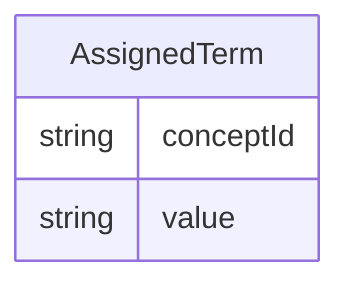

# Class: AssignedTerm 


URI: [cosmos_sdtm:class/AssignedTerm](https://www.cdisc.org/cosmos/sdtm_v1.0/class/AssignedTerm)





<!-- no inheritance hierarchy -->


## Slots

| Name | Cardinality and Range | Description | Inheritance |
| ---  | --- | --- | --- |
| [conceptId](../slots/conceptId.md) | 0..1 <br/> [String](../types/String.md) | C-code for assigned term in NCIt or left blank when CDISC terminology does not apply | direct |
| [value](../slots/value.md) | 1 <br/> [String](../types/String.md) | Submission value for assigned term in NCIt if it exists, or an assigned value which will be the default value | direct |


## Usages

| used by | used in | type | used |
| ---  | --- | --- | --- |
| [SDTMVariable](../classes/SDTMVariable.md) | [assignedTerm](../slots/assignedTerm.md) | range | [AssignedTerm](../classes/AssignedTerm.md) |


## Identifier and Mapping Information


### Schema Source


* from schema: https://www.cdisc.org/cosmos/sdtm_v1.0


## Mappings

| Mapping Type | Mapped Value |
| ---  | ---  |
| self | cosmos_sdtm:AssignedTerm |
| native | cosmos_sdtm:AssignedTerm |


## LinkML Source

<!-- TODO: investigate https://stackoverflow.com/questions/37606292/how-to-create-tabbed-code-blocks-in-mkdocs-or-sphinx -->

### Direct

<details>
```yaml
name: AssignedTerm
from_schema: https://www.cdisc.org/cosmos/sdtm_v1.0
attributes:
  conceptId:
    name: conceptId
    description: C-code for assigned term in NCIt or left blank when CDISC terminology
      does not apply
    from_schema: https://www.cdisc.org/cosmos/sdtm_v1.0
    domain_of:
    - CodeList
    - AssignedTerm
    range: string
    required: false
    pattern: ^(C[0-9]+|CNEW)$
  value:
    name: value
    description: Submission value for assigned term in NCIt if it exists, or an assigned
      value which will be the default value
    from_schema: https://www.cdisc.org/cosmos/sdtm_v1.0
    rank: 1000
    domain_of:
    - AssignedTerm
    range: string
    required: true

```
</details>

### Induced

<details>
```yaml
name: AssignedTerm
from_schema: https://www.cdisc.org/cosmos/sdtm_v1.0
attributes:
  conceptId:
    name: conceptId
    description: C-code for assigned term in NCIt or left blank when CDISC terminology
      does not apply
    from_schema: https://www.cdisc.org/cosmos/sdtm_v1.0
    alias: conceptId
    owner: AssignedTerm
    domain_of:
    - CodeList
    - AssignedTerm
    range: string
    required: false
    pattern: ^(C[0-9]+|CNEW)$
  value:
    name: value
    description: Submission value for assigned term in NCIt if it exists, or an assigned
      value which will be the default value
    from_schema: https://www.cdisc.org/cosmos/sdtm_v1.0
    rank: 1000
    alias: value
    owner: AssignedTerm
    domain_of:
    - AssignedTerm
    range: string
    required: true

```
</details>