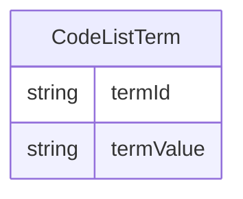

# Class: CodeListTerm 


URI: [cosmos_sdtm:class/CodeListTerm](https://www.cdisc.org/cosmos/sdtm_v1.0/class/CodeListTerm)





<!-- no inheritance hierarchy -->


## Slots

| Name | Cardinality and Range | Description | Inheritance |
| ---  | --- | --- | --- |
| [termId](../slots/termId.md) | 1 <br/> [String](../types/String.md) | C-code term in subset codelist | direct |
| [termValue](../slots/termValue.md) | 1 <br/> [String](../types/String.md) | Submision value of term in subset codelist | direct |


## Usages

| used by | used in | type | used |
| ---  | --- | --- | --- |
| [SubsetCodeList](../classes/SubsetCodeList.md) | [codelistTerm](../slots/codelistTerm.md) | range | [CodeListTerm](../classes/CodeListTerm.md) |


## Identifier and Mapping Information


### Schema Source


* from schema: https://www.cdisc.org/cosmos/sdtm_v1.0


## Mappings

| Mapping Type | Mapped Value |
| ---  | ---  |
| self | cosmos_sdtm:CodeListTerm |
| native | cosmos_sdtm:CodeListTerm |


## LinkML Source

<!-- TODO: investigate https://stackoverflow.com/questions/37606292/how-to-create-tabbed-code-blocks-in-mkdocs-or-sphinx -->

### Direct

<details>
```yaml
name: CodeListTerm
from_schema: https://www.cdisc.org/cosmos/sdtm_v1.0
slots:
- termId
- termValue

```
</details>

### Induced

<details>
```yaml
name: CodeListTerm
from_schema: https://www.cdisc.org/cosmos/sdtm_v1.0
attributes:
  termId:
    name: termId
    description: C-code term in subset codelist
    from_schema: https://www.cdisc.org/cosmos/sdtm_v1.0
    rank: 1000
    alias: termId
    owner: CodeListTerm
    domain_of:
    - CodeListTerm
    range: string
    required: true
    pattern: ^(C[0-9]+)$
  termValue:
    name: termValue
    description: Submision value of term in subset codelist
    from_schema: https://www.cdisc.org/cosmos/sdtm_v1.0
    rank: 1000
    alias: termValue
    owner: CodeListTerm
    domain_of:
    - CodeListTerm
    range: string
    required: true

```
</details>