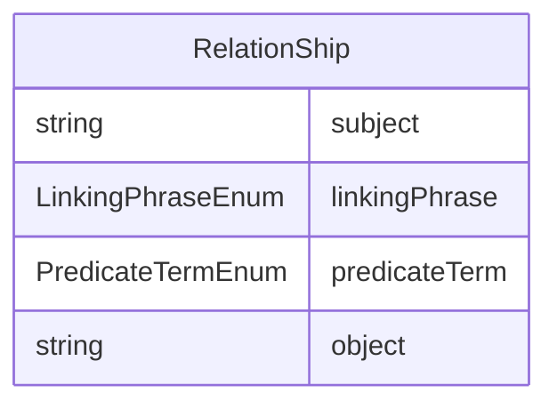

# Class: RelationShip 


URI: [cosmos_sdtm:class/RelationShip](https://www.cdisc.org/cosmos/sdtm_v1.0/class/RelationShip)





<!-- no inheritance hierarchy -->


## Slots

| Name | Cardinality and Range | Description | Inheritance |
| ---  | --- | --- | --- |
| [subject](../slots/subject.md) | 1 <br/> [String](../types/String.md) | Subject in a variable relationship | direct |
| [linkingPhrase](../slots/linkingPhrase.md) | 1 <br/> [LinkingPhraseEnum](../enums/LinkingPhraseEnum.md) | Variable relationship descriptive linking phrase | direct |
| [predicateTerm](../slots/predicateTerm.md) | 1 <br/> [PredicateTermEnum](../enums/PredicateTermEnum.md) | Short variable relationship linking phrase for programming purposes | direct |
| [object](../slots/object.md) | 1 <br/> [String](../types/String.md) | Object in a variable relationship | direct |


## Usages

| used by | used in | type | used |
| ---  | --- | --- | --- |
| [SDTMVariable](../classes/SDTMVariable.md) | [relationship](../slots/relationship.md) | range | [RelationShip](../classes/RelationShip.md) |


## Identifier and Mapping Information


### Schema Source


* from schema: https://www.cdisc.org/cosmos/sdtm_v1.0


## Mappings

| Mapping Type | Mapped Value |
| ---  | ---  |
| self | cosmos_sdtm:RelationShip |
| native | cosmos_sdtm:RelationShip |


## LinkML Source

<!-- TODO: investigate https://stackoverflow.com/questions/37606292/how-to-create-tabbed-code-blocks-in-mkdocs-or-sphinx -->

### Direct

<details>
```yaml
name: RelationShip
from_schema: https://www.cdisc.org/cosmos/sdtm_v1.0
slots:
- subject
- linkingPhrase
- predicateTerm
- object

```
</details>

### Induced

<details>
```yaml
name: RelationShip
from_schema: https://www.cdisc.org/cosmos/sdtm_v1.0
attributes:
  subject:
    name: subject
    description: Subject in a variable relationship
    from_schema: https://www.cdisc.org/cosmos/sdtm_v1.0
    rank: 1000
    alias: subject
    owner: RelationShip
    domain_of:
    - RelationShip
    range: string
    required: true
  linkingPhrase:
    name: linkingPhrase
    description: Variable relationship descriptive linking phrase
    from_schema: https://www.cdisc.org/cosmos/sdtm_v1.0
    rank: 1000
    alias: linkingPhrase
    owner: RelationShip
    domain_of:
    - RelationShip
    range: LinkingPhraseEnum
    required: true
  predicateTerm:
    name: predicateTerm
    description: Short variable relationship linking phrase for programming purposes
    from_schema: https://www.cdisc.org/cosmos/sdtm_v1.0
    rank: 1000
    alias: predicateTerm
    owner: RelationShip
    domain_of:
    - RelationShip
    range: PredicateTermEnum
    required: true
  object:
    name: object
    description: Object in a variable relationship
    from_schema: https://www.cdisc.org/cosmos/sdtm_v1.0
    rank: 1000
    alias: object
    owner: RelationShip
    domain_of:
    - RelationShip
    range: string
    required: true

```
</details>