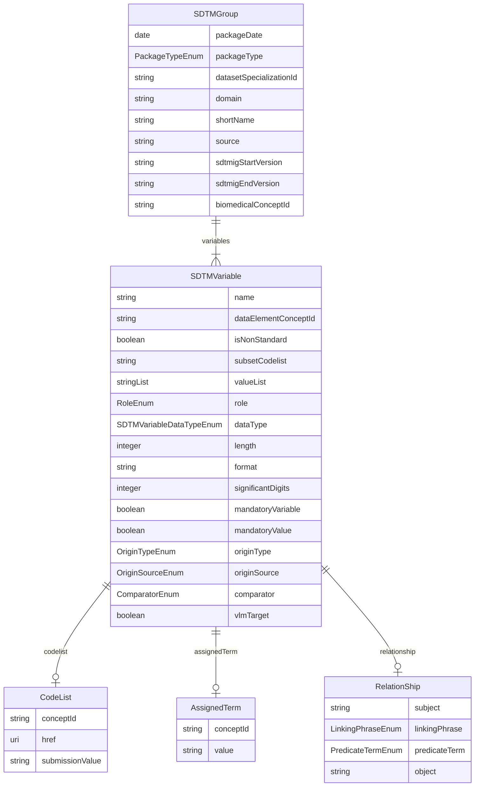

# Class: SDTMGroup 


URI: [cosmos_sdtm:class/SDTMGroup](https://www.cdisc.org/cosmos/sdtm_v1.0/class/SDTMGroup)





<!-- no inheritance hierarchy -->


## Slots

| Name | Cardinality and Range | Description | Inheritance |
| ---  | --- | --- | --- |
| [packageDate](../slots/packageDate.md) | 1 <br/> [Date](../types/Date.md) | Biomedical Concept package release date indicating when the BC package was published to production | direct |
| [packageType](../slots/packageType.md) | 1 <br/> [PackageTypeEnum](../enums/PackageTypeEnum.md) | Package type (sdtm for SDTM Dataset Specializations) | direct |
| [datasetSpecializationId](../slots/datasetSpecializationId.md) | 1 <br/> [String](../types/String.md) | Identifier for SDTM Value Level Metadata group | direct |
| [domain](../slots/domain.md) | 1 <br/> [String](../types/String.md) | Domain for the SDTM specialization group | direct |
| [shortName](../slots/shortName.md) | 1 <br/> [String](../types/String.md) | SDTM group short name which provides a user friendly and intuitive name for the vlm_group_id | direct |
| [source](../slots/source.md) | 1 <br/> [String](../types/String.md) | SDTM VLM Source which categorizes VLM groups by topic variable | direct |
| [sdtmigStartVersion](../slots/sdtmigStartVersion.md) | 1 <br/> [String](../types/String.md) | The earliest SDTMIG version applicable to the BC dataset specialization | direct |
| [sdtmigEndVersion](../slots/sdtmigEndVersion.md) | 0..1 <br/> [String](../types/String.md) | The last SDTMIG version that is applicable to the BC dataset specialization | direct |
| [biomedicalConceptId](../slots/biomedicalConceptId.md) | 0..1 _recommended_ <br/> [String](../types/String.md) | Biomedical Concept identifier foreign key | direct |
| [variables](../slots/variables.md) | 1..* <br/> [SDTMVariable](../classes/SDTMVariable.md) | Variable included in the SDTM dataset specialization | direct |


## Identifier and Mapping Information


### Schema Source


* from schema: https://www.cdisc.org/cosmos/sdtm_v1.0


## Mappings

| Mapping Type | Mapped Value |
| ---  | ---  |
| self | cosmos_sdtm:SDTMGroup |
| native | cosmos_sdtm:SDTMGroup |


## LinkML Source

<!-- TODO: investigate https://stackoverflow.com/questions/37606292/how-to-create-tabbed-code-blocks-in-mkdocs-or-sphinx -->

### Direct

<details>
```yaml
name: SDTMGroup
from_schema: https://www.cdisc.org/cosmos/sdtm_v1.0
slots:
- packageDate
- packageType
- datasetSpecializationId
- domain
- shortName
- source
- sdtmigStartVersion
- sdtmigEndVersion
- biomedicalConceptId
- variables
tree_root: true

```
</details>

### Induced

<details>
```yaml
name: SDTMGroup
from_schema: https://www.cdisc.org/cosmos/sdtm_v1.0
attributes:
  packageDate:
    name: packageDate
    description: Biomedical Concept package release date indicating when the BC package
      was published to production
    from_schema: https://www.cdisc.org/cosmos/sdtm_v1.0
    rank: 1000
    alias: packageDate
    owner: SDTMGroup
    domain_of:
    - SDTMGroup
    range: date
    required: true
  packageType:
    name: packageType
    description: Package type (sdtm for SDTM Dataset Specializations)
    from_schema: https://www.cdisc.org/cosmos/sdtm_v1.0
    rank: 1000
    alias: packageType
    owner: SDTMGroup
    domain_of:
    - SDTMGroup
    range: PackageTypeEnum
    required: true
  datasetSpecializationId:
    name: datasetSpecializationId
    description: Identifier for SDTM Value Level Metadata group
    from_schema: https://www.cdisc.org/cosmos/sdtm_v1.0
    rank: 1000
    identifier: true
    alias: datasetSpecializationId
    owner: SDTMGroup
    domain_of:
    - SDTMGroup
    range: string
    required: true
    pattern: ^[A-Z][A-Z0-9_]*$
  domain:
    name: domain
    description: Domain for the SDTM specialization group
    from_schema: https://www.cdisc.org/cosmos/sdtm_v1.0
    rank: 1000
    alias: domain
    owner: SDTMGroup
    domain_of:
    - SDTMGroup
    range: string
    required: true
  shortName:
    name: shortName
    description: SDTM group short name which provides a user friendly and intuitive
      name for the vlm_group_id
    from_schema: https://www.cdisc.org/cosmos/sdtm_v1.0
    rank: 1000
    alias: shortName
    owner: SDTMGroup
    domain_of:
    - SDTMGroup
    range: string
    required: true
  source:
    name: source
    description: SDTM VLM Source which categorizes VLM groups by topic variable
    from_schema: https://www.cdisc.org/cosmos/sdtm_v1.0
    rank: 1000
    alias: source
    owner: SDTMGroup
    domain_of:
    - SDTMGroup
    range: string
    required: true
  sdtmigStartVersion:
    name: sdtmigStartVersion
    description: The earliest SDTMIG version applicable to the BC dataset specialization
    from_schema: https://www.cdisc.org/cosmos/sdtm_v1.0
    rank: 1000
    alias: sdtmigStartVersion
    owner: SDTMGroup
    domain_of:
    - SDTMGroup
    range: string
    required: true
  sdtmigEndVersion:
    name: sdtmigEndVersion
    description: The last SDTMIG version that is applicable to the BC dataset specialization
    from_schema: https://www.cdisc.org/cosmos/sdtm_v1.0
    rank: 1000
    alias: sdtmigEndVersion
    owner: SDTMGroup
    domain_of:
    - SDTMGroup
    range: string
  biomedicalConceptId:
    name: biomedicalConceptId
    description: Biomedical Concept identifier foreign key
    from_schema: https://www.cdisc.org/cosmos/sdtm_v1.0
    rank: 1000
    alias: biomedicalConceptId
    owner: SDTMGroup
    domain_of:
    - SDTMGroup
    range: string
    recommended: true
    pattern: ^(C[0-9]+|NEW_[A-Z_]*[0-9]*)$
  variables:
    name: variables
    description: Variable included in the SDTM dataset specialization
    from_schema: https://www.cdisc.org/cosmos/sdtm_v1.0
    rank: 1000
    alias: variables
    owner: SDTMGroup
    domain_of:
    - SDTMGroup
    range: SDTMVariable
    required: true
    multivalued: true
    inlined: true
    inlined_as_list: true
tree_root: true

```
</details>