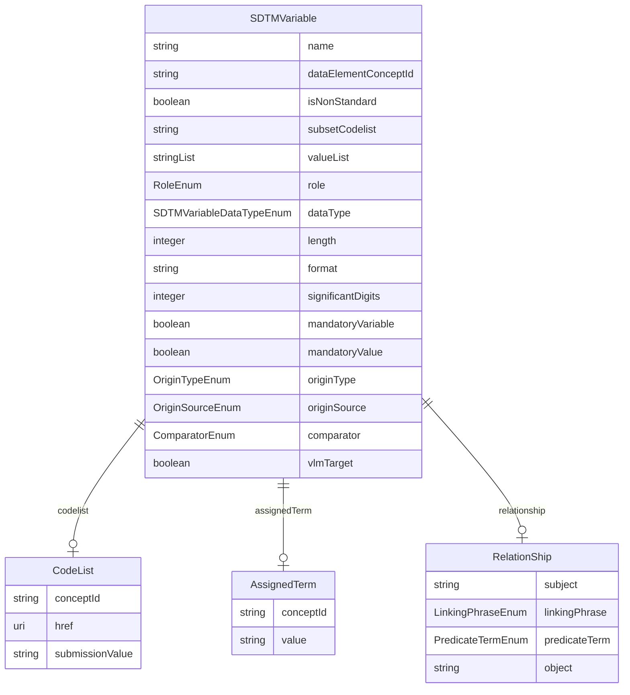

# Class: SDTMVariable 


URI: [cosmos_sdtm:class/SDTMVariable](https://www.cdisc.org/cosmos/sdtm_v1.0/class/SDTMVariable)





<!-- no inheritance hierarchy -->


## Slots

| Name | Cardinality and Range | Description | Inheritance |
| ---  | --- | --- | --- |
| [name](../slots/name.md) | 1 <br/> [String](../types/String.md) | Variable included in the SDTM dataset specialization | direct |
| [dataElementConceptId](../slots/dataElementConceptId.md) | 0..1 <br/> [String](../types/String.md) | Biomedical Concept Data Element Concept identifier foreign key | direct |
| [isNonStandard](../slots/isNonStandard.md) | 0..1 <br/> [Boolean](../types/Boolean.md) | Flag that indicates if the variable is a non-standard variable | direct |
| [codelist](../slots/codelist.md) | 0..1 <br/> [CodeList](../classes/CodeList.md) | Codelist | direct |
| [subsetCodelist](../slots/subsetCodelist.md) | 0..1 <br/> [String](../types/String.md) | Subset codelist short name | direct |
| [valueList](../slots/valueList.md) | * <br/> [String](../types/String.md) | List of SDTM submission values used if subset codelist is not applicable | direct |
| [assignedTerm](../slots/assignedTerm.md) | 0..1 <br/> [AssignedTerm](../classes/AssignedTerm.md) | Assigned term | direct |
| [role](../slots/role.md) | 0..1 <br/> [RoleEnum](../enums/RoleEnum.md) | SDTM variable role | direct |
| [relationship](../slots/relationship.md) | 0..1 <br/> [RelationShip](../classes/RelationShip.md) | Relationship between variables | direct |
| [dataType](../slots/dataType.md) | 0..1 <br/> [SDTMVariableDataTypeEnum](../enums/SDTMVariableDataTypeEnum.md) | Variable data type | direct |
| [length](../slots/length.md) | 0..1 <br/> [Integer](../types/Integer.md) | Variable length | direct |
| [format](../slots/format.md) | 0..1 <br/> [String](../types/String.md) | Variable display format | direct |
| [significantDigits](../slots/significantDigits.md) | 0..1 <br/> [Integer](../types/Integer.md) | Variable significant_digits | direct |
| [mandatoryVariable](../slots/mandatoryVariable.md) | 0..1 <br/> [Boolean](../types/Boolean.md) | Indicator that variable must be present within the SDTM group | direct |
| [mandatoryValue](../slots/mandatoryValue.md) | 0..1 <br/> [Boolean](../types/Boolean.md) | Indicator that variable must be populated within the SDTM group | direct |
| [originType](../slots/originType.md) | 0..1 <br/> [OriginTypeEnum](../enums/OriginTypeEnum.md) | Variable origin type (define-XML v21) | direct |
| [originSource](../slots/originSource.md) | 0..1 <br/> [OriginSourceEnum](../enums/OriginSourceEnum.md) | Variable origin source (define-XML v21) | direct |
| [comparator](../slots/comparator.md) | 0..1 <br/> [ComparatorEnum](../enums/ComparatorEnum.md) | Comparison operator for SDTM group variables included in VLM | direct |
| [vlmTarget](../slots/vlmTarget.md) | 0..1 <br/> [Boolean](../types/Boolean.md) | Target variable for VLM | direct |


## Usages

| used by | used in | type | used |
| ---  | --- | --- | --- |
| [SDTMGroup](../classes/SDTMGroup.md) | [variables](../slots/variables.md) | range | [SDTMVariable](../classes/SDTMVariable.md) |


## Identifier and Mapping Information


### Schema Source


* from schema: https://www.cdisc.org/cosmos/sdtm_v1.0


## Mappings

| Mapping Type | Mapped Value |
| ---  | ---  |
| self | cosmos_sdtm:SDTMVariable |
| native | cosmos_sdtm:SDTMVariable |


## LinkML Source

<!-- TODO: investigate https://stackoverflow.com/questions/37606292/how-to-create-tabbed-code-blocks-in-mkdocs-or-sphinx -->

### Direct

<details>
```yaml
name: SDTMVariable
from_schema: https://www.cdisc.org/cosmos/sdtm_v1.0
slots:
- name
- dataElementConceptId
- isNonStandard
- codelist
- subsetCodelist
- valueList
- assignedTerm
- role
- relationship
- dataType
- length
- format
- significantDigits
- mandatoryVariable
- mandatoryValue
- originType
- originSource
- comparator
- vlmTarget

```
</details>

### Induced

<details>
```yaml
name: SDTMVariable
from_schema: https://www.cdisc.org/cosmos/sdtm_v1.0
attributes:
  name:
    name: name
    description: Variable included in the SDTM dataset specialization
    from_schema: https://www.cdisc.org/cosmos/sdtm_v1.0
    rank: 1000
    identifier: true
    alias: name
    owner: SDTMVariable
    domain_of:
    - SDTMVariable
    range: string
    required: true
    pattern: ^[A-Z][A-Z0-9_]*$
  dataElementConceptId:
    name: dataElementConceptId
    description: Biomedical Concept Data Element Concept identifier foreign key
    from_schema: https://www.cdisc.org/cosmos/sdtm_v1.0
    rank: 1000
    alias: dataElementConceptId
    owner: SDTMVariable
    domain_of:
    - SDTMVariable
    range: string
    pattern: ^(C[0-9]+|NEW_[A-Z_]*[0-9]*)$
  isNonStandard:
    name: isNonStandard
    description: Flag that indicates if the variable is a non-standard variable
    from_schema: https://www.cdisc.org/cosmos/sdtm_v1.0
    rank: 1000
    alias: isNonStandard
    owner: SDTMVariable
    domain_of:
    - SDTMVariable
    range: boolean
  codelist:
    name: codelist
    description: Codelist
    from_schema: https://www.cdisc.org/cosmos/sdtm_v1.0
    rank: 1000
    alias: codelist
    owner: SDTMVariable
    domain_of:
    - SDTMVariable
    range: CodeList
    inlined: true
  subsetCodelist:
    name: subsetCodelist
    description: Subset codelist short name
    from_schema: https://www.cdisc.org/cosmos/sdtm_v1.0
    rank: 1000
    alias: subsetCodelist
    owner: SDTMVariable
    domain_of:
    - SDTMVariable
    range: string
    pattern: ^[A-Z][A-Z0-9_]*$
  valueList:
    name: valueList
    description: List of SDTM submission values used if subset codelist is not applicable
    from_schema: https://www.cdisc.org/cosmos/sdtm_v1.0
    rank: 1000
    alias: valueList
    owner: SDTMVariable
    domain_of:
    - SDTMVariable
    range: string
    multivalued: true
    inlined: true
    inlined_as_list: true
  assignedTerm:
    name: assignedTerm
    description: Assigned term
    from_schema: https://www.cdisc.org/cosmos/sdtm_v1.0
    rank: 1000
    alias: assignedTerm
    owner: SDTMVariable
    domain_of:
    - SDTMVariable
    range: AssignedTerm
  role:
    name: role
    description: SDTM variable role
    from_schema: https://www.cdisc.org/cosmos/sdtm_v1.0
    rank: 1000
    alias: role
    owner: SDTMVariable
    domain_of:
    - SDTMVariable
    range: RoleEnum
  relationship:
    name: relationship
    description: Relationship between variables
    from_schema: https://www.cdisc.org/cosmos/sdtm_v1.0
    rank: 1000
    alias: relationship
    owner: SDTMVariable
    domain_of:
    - SDTMVariable
    range: RelationShip
  dataType:
    name: dataType
    description: Variable data type
    from_schema: https://www.cdisc.org/cosmos/sdtm_v1.0
    rank: 1000
    alias: dataType
    owner: SDTMVariable
    domain_of:
    - SDTMVariable
    range: SDTMVariableDataTypeEnum
  length:
    name: length
    description: Variable length
    from_schema: https://www.cdisc.org/cosmos/sdtm_v1.0
    rank: 1000
    alias: length
    owner: SDTMVariable
    domain_of:
    - SDTMVariable
    range: integer
    minimum_value: 1
  format:
    name: format
    description: Variable display format
    from_schema: https://www.cdisc.org/cosmos/sdtm_v1.0
    rank: 1000
    alias: format
    owner: SDTMVariable
    domain_of:
    - SDTMVariable
    range: string
  significantDigits:
    name: significantDigits
    description: Variable significant_digits
    from_schema: https://www.cdisc.org/cosmos/sdtm_v1.0
    rank: 1000
    alias: significantDigits
    owner: SDTMVariable
    domain_of:
    - SDTMVariable
    range: integer
  mandatoryVariable:
    name: mandatoryVariable
    description: Indicator that variable must be present within the SDTM group
    from_schema: https://www.cdisc.org/cosmos/sdtm_v1.0
    rank: 1000
    alias: mandatoryVariable
    owner: SDTMVariable
    domain_of:
    - SDTMVariable
    range: boolean
  mandatoryValue:
    name: mandatoryValue
    description: Indicator that variable must be populated within the SDTM group
    from_schema: https://www.cdisc.org/cosmos/sdtm_v1.0
    rank: 1000
    alias: mandatoryValue
    owner: SDTMVariable
    domain_of:
    - SDTMVariable
    range: boolean
  originType:
    name: originType
    description: Variable origin type (define-XML v21)
    from_schema: https://www.cdisc.org/cosmos/sdtm_v1.0
    rank: 1000
    alias: originType
    owner: SDTMVariable
    domain_of:
    - SDTMVariable
    range: OriginTypeEnum
  originSource:
    name: originSource
    description: Variable origin source (define-XML v21)
    from_schema: https://www.cdisc.org/cosmos/sdtm_v1.0
    rank: 1000
    alias: originSource
    owner: SDTMVariable
    domain_of:
    - SDTMVariable
    range: OriginSourceEnum
  comparator:
    name: comparator
    description: Comparison operator for SDTM group variables included in VLM
    from_schema: https://www.cdisc.org/cosmos/sdtm_v1.0
    rank: 1000
    alias: comparator
    owner: SDTMVariable
    domain_of:
    - SDTMVariable
    range: ComparatorEnum
  vlmTarget:
    name: vlmTarget
    description: Target variable for VLM
    from_schema: https://www.cdisc.org/cosmos/sdtm_v1.0
    rank: 1000
    alias: vlmTarget
    owner: SDTMVariable
    domain_of:
    - SDTMVariable
    range: boolean

```
</details>