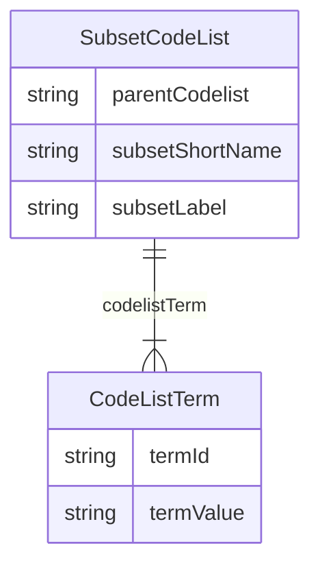

# Class: SubsetCodeList 


URI: [cosmos_sdtm:class/SubsetCodeList](https://www.cdisc.org/cosmos/sdtm_v1.0/class/SubsetCodeList)





<!-- no inheritance hierarchy -->


## Slots

| Name | Cardinality and Range | Description | Inheritance |
| ---  | --- | --- | --- |
| [parentCodelist](../slots/parentCodelist.md) | 1 <br/> [String](../types/String.md) | Subset codelist parent codelist | direct |
| [subsetShortName](../slots/subsetShortName.md) | 1 <br/> [String](../types/String.md) | Subset codelist short name | direct |
| [subsetLabel](../slots/subsetLabel.md) | 1 <br/> [String](../types/String.md) | Subset codelist label | direct |
| [codelistTerm](../slots/codelistTerm.md) | 1..* <br/> [CodeListTerm](../classes/CodeListTerm.md) | Term in subset codelist | direct |


## Identifier and Mapping Information


### Schema Source


* from schema: https://www.cdisc.org/cosmos/sdtm_v1.0


## Mappings

| Mapping Type | Mapped Value |
| ---  | ---  |
| self | cosmos_sdtm:SubsetCodeList |
| native | cosmos_sdtm:SubsetCodeList |


## LinkML Source

<!-- TODO: investigate https://stackoverflow.com/questions/37606292/how-to-create-tabbed-code-blocks-in-mkdocs-or-sphinx -->

### Direct

<details>
```yaml
name: SubsetCodeList
from_schema: https://www.cdisc.org/cosmos/sdtm_v1.0
slots:
- parentCodelist
- subsetShortName
- subsetLabel
- codelistTerm

```
</details>

### Induced

<details>
```yaml
name: SubsetCodeList
from_schema: https://www.cdisc.org/cosmos/sdtm_v1.0
attributes:
  parentCodelist:
    name: parentCodelist
    description: Subset codelist parent codelist
    from_schema: https://www.cdisc.org/cosmos/sdtm_v1.0
    rank: 1000
    alias: parentCodelist
    owner: SubsetCodeList
    domain_of:
    - SubsetCodeList
    range: string
    required: true
    pattern: ^C[0-9]+$
  subsetShortName:
    name: subsetShortName
    description: Subset codelist short name
    from_schema: https://www.cdisc.org/cosmos/sdtm_v1.0
    rank: 1000
    alias: subsetShortName
    owner: SubsetCodeList
    domain_of:
    - SubsetCodeList
    range: string
    required: true
    pattern: ^[A-Z][A-Z0-9_]*$
  subsetLabel:
    name: subsetLabel
    description: Subset codelist label
    from_schema: https://www.cdisc.org/cosmos/sdtm_v1.0
    rank: 1000
    alias: subsetLabel
    owner: SubsetCodeList
    domain_of:
    - SubsetCodeList
    range: string
    required: true
  codelistTerm:
    name: codelistTerm
    description: Term in subset codelist
    from_schema: https://www.cdisc.org/cosmos/sdtm_v1.0
    rank: 1000
    alias: codelistTerm
    owner: SubsetCodeList
    domain_of:
    - SubsetCodeList
    range: CodeListTerm
    required: true
    multivalued: true
    inlined: true
    inlined_as_list: true

```
</details>