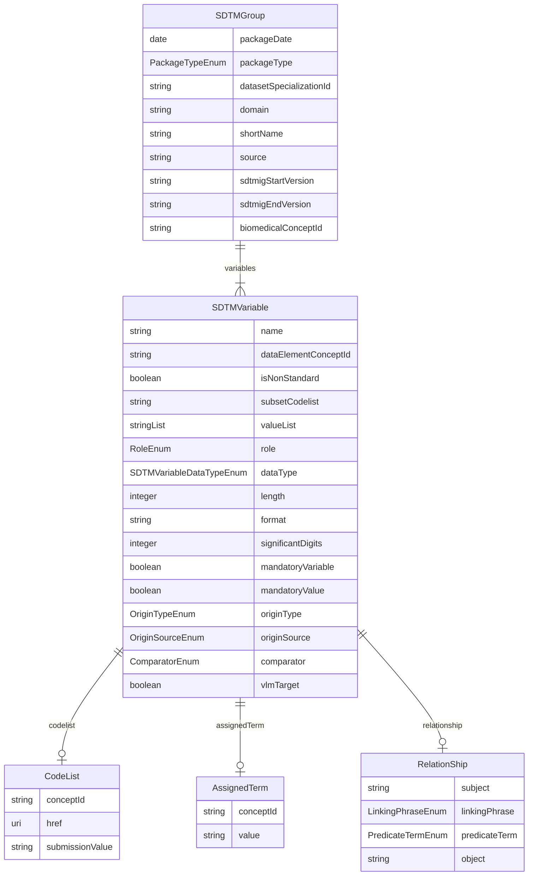

# COSMoS-Biomedical-Concepts-SDTM-Schema

URI: https://www.cdisc.org/cosmos/sdtm_v1.0

Name: COSMoS-Biomedical-Concepts-SDTM-Schema

## Schema Diagram

## Classes

| Class | Description |
| --- | --- |
| [AssignedTerm](classes/AssignedTerm.md) |  |
| [CodeList](classes/CodeList.md) |  |
| [CodeListTerm](classes/CodeListTerm.md) |  |
| [RelationShip](classes/RelationShip.md) |  |
| [SDTMGroup](classes/SDTMGroup.md) |  |
| [SDTMVariable](classes/SDTMVariable.md) |  |
| [SubsetCodeList](classes/SubsetCodeList.md) |  |

## Slots

| Slot | Description |
| --- | --- |
| [packageDate](slots/packageDate.md) | Biomedical Concept package release date indicating when the BC package was published to production |
| [packageType](slots/packageType.md) | Package type (sdtm for SDTM Dataset Specializations) |
| [datasetSpecializationId](slots/datasetSpecializationId.md) | Identifier for SDTM Value Level Metadata group |
| [domain](slots/domain.md) | Domain for the SDTM specialization group |
| [source](slots/source.md) | SDTM VLM Source which categorizes VLM groups by topic variable |
| [shortName](slots/shortName.md) | SDTM group short name which provides a user friendly and intuitive name for the vlm_group_id |
| [sdtmigStartVersion](slots/sdtmigStartVersion.md) | The earliest SDTMIG version applicable to the BC dataset specialization |
| [sdtmigEndVersion](slots/sdtmigEndVersion.md) | The last SDTMIG version that is applicable to the BC dataset specialization |
| [biomedicalConceptId](slots/biomedicalConceptId.md) | Biomedical Concept identifier foreign key |
| [variables](slots/variables.md) | Variable included in the SDTM dataset specialization |
| [name](slots/name.md) | Variable included in the SDTM dataset specialization |
| [dataElementConceptId](slots/dataElementConceptId.md) | Biomedical Concept Data Element Concept identifier foreign key |
| [isNonStandard](slots/isNonStandard.md) | Flag that indicates if the variable is a non-standard variable |
| [codelist](slots/codelist.md) | Codelist |
| [subsetCodelist](slots/subsetCodelist.md) | Subset codelist short name |
| [conceptId](slots/conceptId.md) | C-code for a codelist in NCIt |
| [href](slots/href.md) | Link to NCIt for the codelist |
| [submissionValue](slots/submissionValue.md) | CDISC submission value for the codelist |
| [parentCodelist](slots/parentCodelist.md) | Subset codelist parent codelist |
| [subsetShortName](slots/subsetShortName.md) | Subset codelist short name |
| [subsetLabel](slots/subsetLabel.md) | Subset codelist label |
| [codelistTerm](slots/codelistTerm.md) | Term in subset codelist |
| [termId](slots/termId.md) | C-code term in subset codelist |
| [termValue](slots/termValue.md) | Submision value of term in subset codelist |
| [valueList](slots/valueList.md) | List of SDTM submission values used if subset codelist is not applicable |
| [assignedTerm](slots/assignedTerm.md) | Assigned term |
| [role](slots/role.md) | SDTM variable role |
| [relationship](slots/relationship.md) | Relationship between variables |
| [subject](slots/subject.md) | Subject in a variable relationship |
| [linkingPhrase](slots/linkingPhrase.md) | Variable relationship descriptive linking phrase |
| [predicateTerm](slots/predicateTerm.md) | Short variable relationship linking phrase for programming purposes |
| [object](slots/object.md) | Object in a variable relationship |
| [dataType](slots/dataType.md) | Variable data type |
| [length](slots/length.md) | Variable length |
| [format](slots/format.md) | Variable display format |
| [significantDigits](slots/significantDigits.md) | Variable significant_digits |
| [mandatoryVariable](slots/mandatoryVariable.md) | Indicator that variable must be present within the SDTM group |
| [mandatoryValue](slots/mandatoryValue.md) | Indicator that variable must be populated within the SDTM group |
| [originType](slots/originType.md) | Variable origin type (define-XML v21) |
| [originSource](slots/originSource.md) | Variable origin source (define-XML v21) |
| [comparator](slots/comparator.md) | Comparison operator for SDTM group variables included in VLM |
| [vlmTarget](slots/vlmTarget.md) | Target variable for VLM |
| [value](slots/value.md) | Submission value for assigned term in NCIt if it exists, or an assigned value which will be the default value |

## Enumerations

| Enumeration | Description |
| --- | --- |
| [PackageTypeEnum](enums/PackageTypeEnum.md) |  |
| [SDTMVariableDataTypeEnum](enums/SDTMVariableDataTypeEnum.md) |  |
| [LinkingPhraseEnum](enums/LinkingPhraseEnum.md) |  |
| [PredicateTermEnum](enums/PredicateTermEnum.md) |  |
| [OriginTypeEnum](enums/OriginTypeEnum.md) | Terminology relevant to the origin type for datasets in the Define-XML document. |
| [OriginSourceEnum](enums/OriginSourceEnum.md) | Terminology relevant to the origin source for datasets in the Define-XML document. |
| [RoleEnum](enums/RoleEnum.md) |  |
| [ComparatorEnum](enums/ComparatorEnum.md) |  |

## Types

| Type | Description |
| --- | --- |
| [String](types/String.md) | A character string |
| [Integer](types/Integer.md) | An integer |
| [Boolean](types/Boolean.md) | A binary (true or false) value |
| [Float](types/Float.md) | A real number that conforms to the xsd:float specification |
| [Double](types/Double.md) | A real number that conforms to the xsd:double specification |
| [Decimal](types/Decimal.md) | A real number with arbitrary precision that conforms to the xsd:decimal specification |
| [Time](types/Time.md) | A time object represents a (local) time of day, independent of any particular day |
| [Date](types/Date.md) | a date (year, month and day) in an idealized calendar |
| [Datetime](types/Datetime.md) | The combination of a date and time |
| [DateOrDatetime](types/DateOrDatetime.md) | Either a date or a datetime |
| [Uriorcurie](types/Uriorcurie.md) | a URI or a CURIE |
| [Curie](types/Curie.md) | a compact URI |
| [Uri](types/Uri.md) | a complete URI |
| [Ncname](types/Ncname.md) | Prefix part of CURIE |
| [Objectidentifier](types/Objectidentifier.md) | A URI or CURIE that represents an object in the model. |
| [Nodeidentifier](types/Nodeidentifier.md) | A URI, CURIE or BNODE that represents a node in a model. |
| [Jsonpointer](types/Jsonpointer.md) | A string encoding a JSON Pointer. The value of the string MUST conform to JSON Point syntax and SHOULD dereference to a valid object within the current instance document when encoded in tree form. |
| [Jsonpath](types/Jsonpath.md) | A string encoding a JSON Path. The value of the string MUST conform to JSON Point syntax and SHOULD dereference to zero or more valid objects within the current instance document when encoded in tree form. |
| [Sparqlpath](types/Sparqlpath.md) | A string encoding a SPARQL Property Path. The value of the string MUST conform to SPARQL syntax and SHOULD dereference to zero or more valid objects within the current instance document when encoded as RDF. |

## Subsets

| Subset | Description |
| --- | --- |
