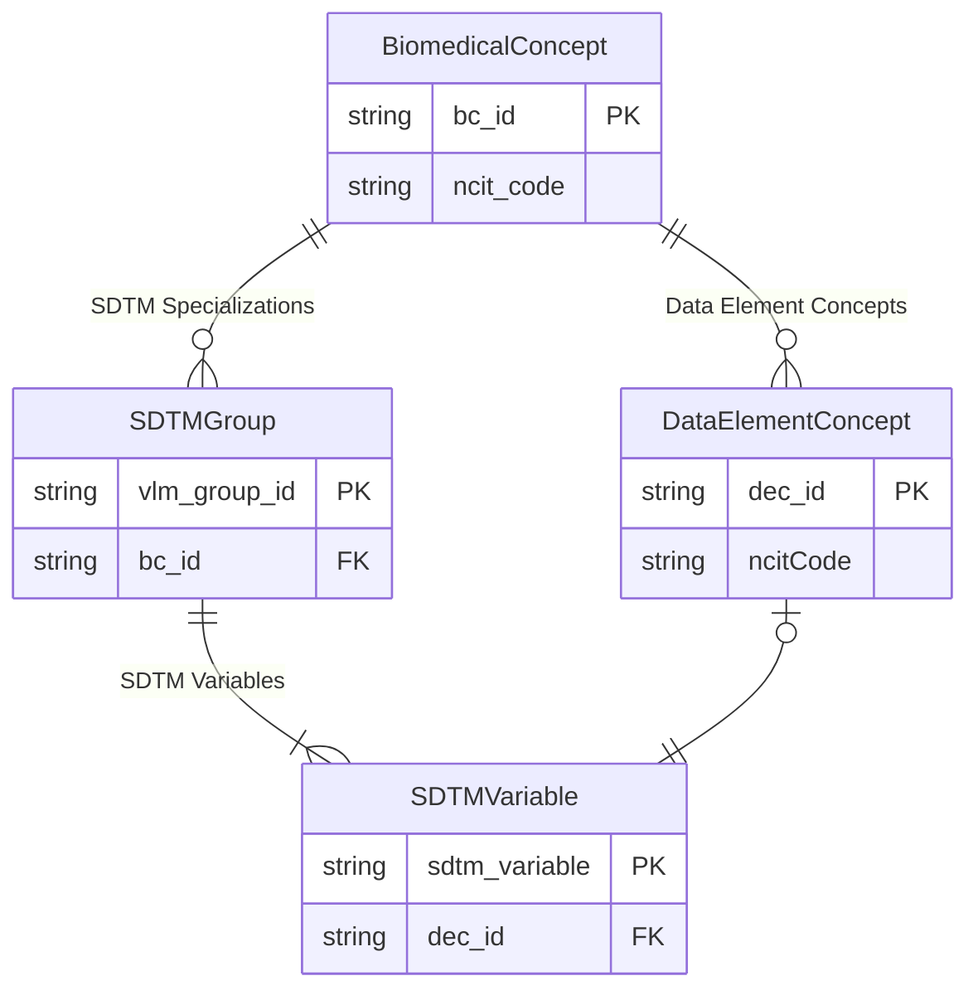

```mermaid
erDiagram
BiomedicalConcept {
    string bc_id PK
    string ncit_code  
}

DataElementConcept {
    string dec_id PK
    string ncitCode  
}

SDTMGroup {
    string vlm_group_id PK
    string bc_id FK  
}

SDTMVariable {
    string sdtm_variable PK
    string dec_id FK
}


BiomedicalConcept ||--}o DataElementConcept : "Data Element Concepts"
SDTMGroup ||--}| SDTMVariable : "SDTM Variables"
BiomedicalConcept ||--}o SDTMGroup : "SDTM Specializations"
DataElementConcept |o--|| SDTMVariable : ""

```
